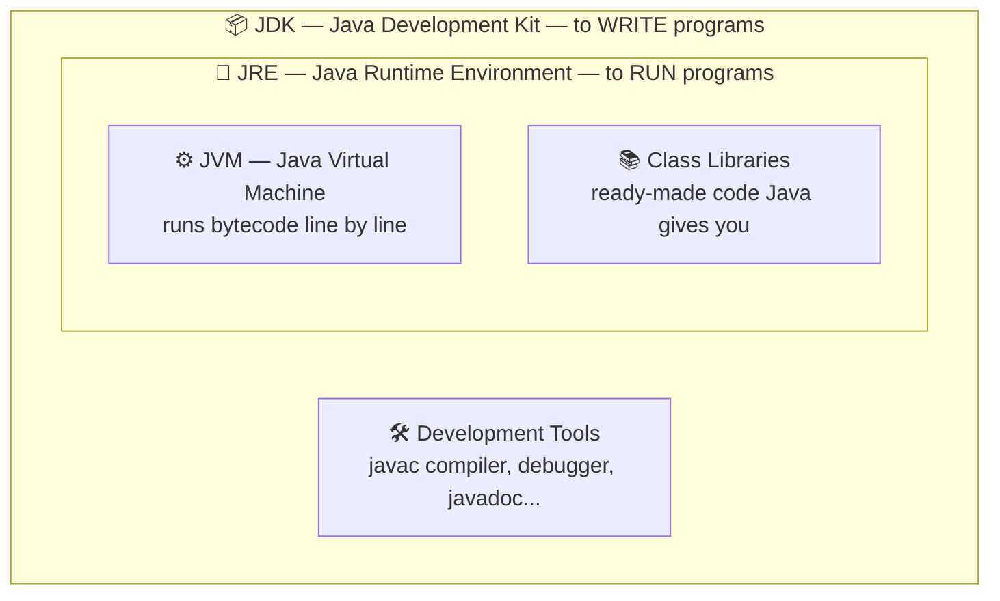
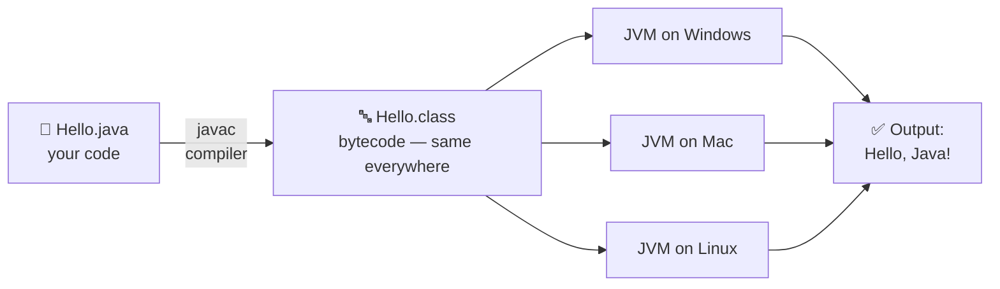

# 01 — Java Basics: What is Java & How Does It Actually Run?

> **Read this first.** If this note is clear, half of your Java fear is gone.

---

## 1. What is Java? (Simple words)

Java is a **programming language** — a way to give instructions to the computer.

Computer only understands 0s and 1s (machine language). We can't write in 0s and 1s, so we write in Java (English-like language), and Java converts it for the computer.

**Why is Java famous?**
- **Write Once, Run Anywhere (WORA)** — write code on Windows, run it on Mac/Linux/Android without changing anything.
- Used in: Android apps, banking software, big company servers, games (Minecraft is written in Java!).

---

## 2. JDK vs JRE vs JVM (Most confusing thing for beginners — made simple)

### 🏭 Real-life analogy: A kitchen

| Term | Full Form | Analogy | Simple meaning |
|------|-----------|---------|----------------|
| **JVM** | Java Virtual Machine | The **cook** | Actually runs your program, line by line |
| **JRE** | Java Runtime Environment | Cook + **kitchen tools** | JVM + libraries needed to RUN Java programs |
| **JDK** | Java Development Kit | Kitchen + cook + **recipe-writing desk** | JRE + tools to WRITE Java programs (compiler etc.) |

**One-line memory trick:**
> JDK ⊃ JRE ⊃ JVM  (JDK contains JRE, JRE contains JVM)

### 📊 Picture it (one look = never forget):



- Want to **run** Java programs only? → JRE is enough.
- Want to **write** Java programs? → You need JDK.

---

## 3. How does Java code actually run? (Step by step)



**Step by step:**
1. You write code in a file: `Hello.java`
2. **Compiler (`javac`)** converts it into **bytecode**: `Hello.class`
   - Bytecode = a universal middle language. Not machine code, not Java.
3. **JVM** reads bytecode and runs it on YOUR machine (Windows/Mac/Linux — each OS has its own JVM).

💡 **This is why Java runs anywhere** — bytecode is the same everywhere; only the JVM changes per OS. (Look at the diagram: ONE bytecode, THREE different JVMs, same output!)

---

## 4. Your First Program (line-by-line explanation)

```java
public class Hello {
    public static void main(String[] args) {
        System.out.println("Hello, Java!");
    }
}
```

**Output:**
```
Hello, Java!
```

### Every word explained:

| Word | Meaning (simple) |
|------|------------------|
| `public` | Anyone can access it (no restriction) |
| `class Hello` | A class named `Hello`. In Java, ALL code lives inside a class. File name must match: `Hello.java` |
| `static` | JVM can call `main` without creating an object (don't worry, clear in OOP notes) |
| `void` | This method returns nothing |
| `main(String[] args)` | The **starting point**. JVM always starts your program from `main` |
| `System.out.println(...)` | Print the message on screen and go to a new line |

💡 **For now, memorize the `main` line as a fixed template.** Its full meaning becomes clear after OOP notes — and that's completely fine.

---

## 5. Common Beginner Mistakes ❌

1. **File name ≠ class name** → `public class Hello` must be saved as `Hello.java` (exact same name, capital H).
2. **Forgetting semicolon `;`** → Every statement ends with `;`
3. **Wrong main spelling** → `main` not `Main`. Java is **case-sensitive** (`Hello` and `hello` are different).
4. **Missing braces `{ }`** → Every `{` must have a closing `}`.

---

## 6. Quick Revision (30 seconds) ⚡

- Java = programming language, famous for **Write Once, Run Anywhere**.
- **JDK** (write) ⊃ **JRE** (run) ⊃ **JVM** (executor).
- Flow: `.java` → compiler → `.class` (bytecode) → JVM → output.
- Program always starts from `main` method.
- Java is case-sensitive; every statement ends with `;`.

---

➡️ **Next note:** [02 — Memory in Java: Stack, Heap, DMA, Garbage Collector](02-memory-heap-stack.md)
