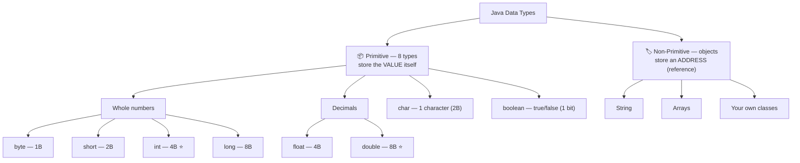
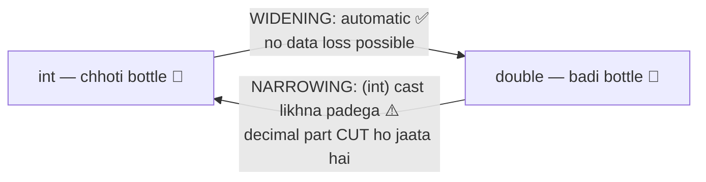

# 03 — Variables & Data Types: Where Your Data Lives

> A variable is just a **named box** in memory. That's it. This note makes boxes crystal clear.

---

## 1. What is a Variable? (Simple words)

A variable = a **box in memory** with:
1. a **name** (so you can find it),
2. a **type** (what kind of thing fits in the box),
3. a **value** (the thing inside).

```java
int age = 20;
```

| Part | Meaning |
|------|---------|
| `int` | type of box (whole numbers only) |
| `age` | name of box |
| `20` | value inside the box |
| `=` | "put this value in the box" (assignment, NOT math equals) |

### 🏭 Analogy: Labeled containers in a kitchen
Sugar container me sugar hi rakhoge, oil nahi. Same way — an `int` box can only hold whole numbers, not text.

---

## 2. The 8 Primitive Data Types (the basic boxes)

Java has exactly **8 primitive types**. Learn this table well — it's asked everywhere.

### 📊 The full family tree (one look = full picture):



| Type | Stores | Size | Range (approx) | Example |
|------|--------|------|----------------|---------|
| `byte` | tiny whole number | 1 byte | -128 to 127 | `byte b = 100;` |
| `short` | small whole number | 2 bytes | -32,768 to 32,767 | `short s = 5000;` |
| `int` | whole number ⭐ | 4 bytes | ±2.1 billion (approx) | `int x = 100000;` |
| `long` | very big whole number | 8 bytes | huge | `long l = 15000000000L;` |
| `float` | decimal (less precise) | 4 bytes | ~6-7 decimal digits | `float f = 5.75f;` |
| `double` | decimal ⭐ | 8 bytes | ~15 decimal digits | `double d = 19.99;` |
| `char` | ONE character | 2 bytes | any single character | `char c = 'A';` |
| `boolean` | true/false | 1 bit | `true` or `false` | `boolean ok = true;` |

⭐ = **most used**. In 90% code you'll use `int`, `double`, `boolean`, `char`.

### ⚠️ Special things to remember:
- `long` value ends with **L** → `15000000000L`
- `float` value ends with **f** → `5.75f` (without f, Java treats decimals as `double`)
- `char` uses **single quotes** `'A'`; `String` uses **double quotes** `"Ashu"`

---

## 3. String — the non-primitive superstar

```java
String name = "Ashu";
```

- `String` is **NOT** a primitive type — it's an **object** (that's why it starts with capital S).
- Remember from note 02: the reference `name` lives in **Stack**, the actual `"Ashu"` object lives in **Heap**.

### Primitive vs Non-Primitive (quick difference)

| | Primitive | Non-Primitive (objects) |
|--|-----------|-------------------------|
| Examples | `int`, `char`, `boolean`... | `String`, arrays, your own classes |
| Stores | actual value | address (reference) of object |
| Lives in | Stack (as local variable) | Heap (object), Stack (reference) |
| Starts with | small letter | Capital letter (convention) |

---

## 4. Type Casting — converting one box to another

### 📊 The two directions (bottle analogy in picture form):



### (a) Widening (small → big) — automatic, safe ✅
```java
int x = 10;
double d = x;      // automatic: 10 → 10.0 (no data loss possible)
System.out.println(d);   // 10.0
```

### (b) Narrowing (big → small) — manual, risky ⚠️
```java
double d = 9.78;
int x = (int) d;   // YOU must write (int) — decimal part is CUT (not rounded!)
System.out.println(x);   // 9  (not 10!)
```

💡 **Memory trick:** Chhoti bottle ka paani badi bottle me daalo → kabhi nahi girta (widening, auto). Badi bottle ka paani chhoti me daalo → gir sakta hai, isliye Java tumse permission maangta hai `(int)` likh ke.

---

## 5. Full example program

```java
public class DataTypesDemo {
    public static void main(String[] args) {
        int age = 20;
        double marks = 88.5;
        char grade = 'A';
        boolean passed = true;
        String name = "Ashu";

        System.out.println(name + " is " + age + " years old");
        System.out.println("Marks: " + marks + ", Grade: " + grade);
        System.out.println("Passed: " + passed);
    }
}
```

**Output:**
```
Ashu is 20 years old
Marks: 88.5, Grade: A
Passed: true
```

💡 `+` with a String joins things together (concatenation). More in the Strings note.

---

## 6. Common Beginner Mistakes ❌

1. `int x = 5.5;` → ❌ decimal can't go in int box. Use `double`.
2. `char c = "A";` → ❌ double quotes make a String. Use `'A'`.
3. `float f = 5.75;` → ❌ missing `f`. Write `5.75f`.
4. Using a variable before giving it a value → ❌ compile error for local variables.
5. `int` overflow: `int` max is ~2.1 billion. For bigger numbers use `long`.

---

## 7. Quick Revision (30 seconds) ⚡

- Variable = named box: **type + name + value**.
- 8 primitives: `byte short int long` (whole), `float double` (decimal), `char` (1 character), `boolean` (true/false).
- `long` → L suffix, `float` → f suffix, `char` → single quotes.
- `String` = object, not primitive.
- Widening (small→big) auto; Narrowing (big→small) needs `(cast)` and cuts decimals.

---

⬅️ **Previous:** [02 — Memory](02-memory-heap-stack.md) | ➡️ **Next:** [04 — Operators](04-operators.md)
