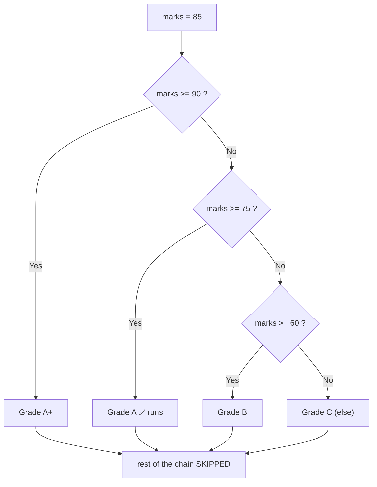
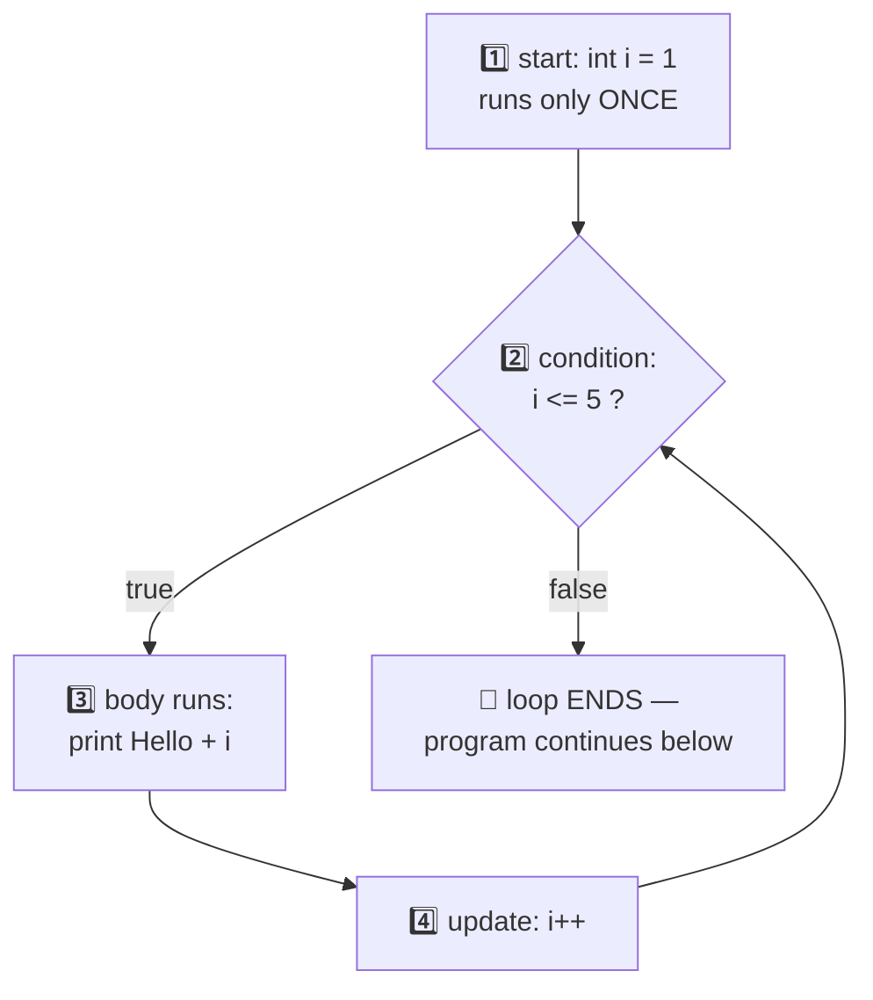

# 05 — Control Flow: Making Decisions & Repeating Work

> Till now our programs ran top-to-bottom like a straight road. Control flow adds **turns** (decisions) and **circles** (loops) to the road. This is where programming becomes REAL.

---

## 1. `if` / `else` — Decisions (simple words)

**"IF this is true, do this. OTHERWISE do that."** Exactly like real life.

```java
int marks = 75;

if (marks >= 40) {
    System.out.println("Pass 🎉");
} else {
    System.out.println("Fail 😢");
}
```
**Output:** `Pass 🎉`

### 🏭 Analogy: A security guard
Guard checks your ID (**condition**). ID valid → entry (**if block**). Not valid → no entry (**else block**).

### `else if` — multiple checks in order

```java
int marks = 85;

if (marks >= 90) {
    System.out.println("Grade A+");
} else if (marks >= 75) {
    System.out.println("Grade A");     // ✅ this runs
} else if (marks >= 60) {
    System.out.println("Grade B");
} else {
    System.out.println("Grade C");
}
```

### 📊 How Java walks through it (marks = 85):



⚠️ **Important:** Java checks top to bottom and runs **only the FIRST true block**, then skips the rest. Order matters!

---

## 2. `switch` — when you compare ONE value with many options

```java
int day = 3;

switch (day) {
    case 1: System.out.println("Monday"); break;
    case 2: System.out.println("Tuesday"); break;
    case 3: System.out.println("Wednesday"); break;   // ✅ matches
    default: System.out.println("Invalid day");
}
```
**Output:** `Wednesday`

### ⚠️ The famous `break` trap (fall-through)
Without `break`, Java keeps running the NEXT cases too!

```java
int day = 2;
switch (day) {
    case 1: System.out.println("Mon");   // no break!
    case 2: System.out.println("Tue");   // matches, runs
    case 3: System.out.println("Wed");   // ALSO runs (no break above)
}
// Output: Tue Wed  ← surprise!
```

💡 **Rule:** `break` = "stop here, exit switch". Almost always write it.

**When to use what:** range checks (`marks >= 40`) → `if-else`. Exact value matching (day number, menu choice) → `switch`.

---

## 3. Loops — Repeating work without copy-paste

Print "Hello" 100 times — copy-paste 100 lines? ❌ Loop me 3 lines ✅

### (a) `for` loop — when you KNOW how many times

```java
for (int i = 1; i <= 5; i++) {
    System.out.println("Hello " + i);
}
```
**Output:**
```
Hello 1
Hello 2
Hello 3
Hello 4
Hello 5
```

### 📊 The for-loop engine (yehi cycle har baar chalta hai):



### The 3 parts of `for` (super important):

```java
for (start; condition; update)
     │       │          │
     │       │          └─ after every round: i++
     │       └─ before every round: continue only if true
     └─ runs ONCE at the beginning: int i = 1
```

### 🔍 Dry run (how it actually executes):
| Round | i | i <= 5? | Action |
|-------|---|---------|--------|
| 1 | 1 | ✅ | print "Hello 1", then i → 2 |
| 2 | 2 | ✅ | print "Hello 2", then i → 3 |
| ... | ... | ... | ... |
| 5 | 5 | ✅ | print "Hello 5", then i → 6 |
| 6 | 6 | ❌ | loop ENDS |

### (b) `while` loop — when you DON'T know how many times

"Keep doing WHILE the condition is true."

```java
int n = 1234;
int count = 0;

while (n > 0) {
    n = n / 10;    // remove last digit (note 04 trick!)
    count++;
}
System.out.println("Digits: " + count);   // Digits: 4
```

### (c) `do-while` loop — runs AT LEAST once

```java
int x = 100;
do {
    System.out.println("Runs once even though condition is false!");
} while (x < 10);
```

💡 **Difference:** `while` checks first, then runs. `do-while` runs first, then checks. Use case: menus ("show menu at least once, repeat until user quits").

---

## 4. `break` and `continue` inside loops

| Keyword | Meaning | Analogy |
|---------|---------|--------|
| `break` | EXIT the loop completely | Movie boring → hall se bahar 🚪 |
| `continue` | SKIP this round, go to next | Ek scene skip karo, movie chalu rakho ⏭️ |

```java
for (int i = 1; i <= 5; i++) {
    if (i == 3) continue;   // skip 3
    if (i == 5) break;      // stop at 5
    System.out.println(i);
}
// Output: 1 2 4
```

---

## 5. Nested loops — loop inside a loop (pattern printing!)

**Rule:** Outer loop = rows, inner loop = columns. Inner loop completes FULLY for each outer round.

```java
for (int i = 1; i <= 3; i++) {          // rows
    for (int j = 1; j <= i; j++) {      // stars in that row
        System.out.print("* ");
    }
    System.out.println();               // new line after each row
}
```
**Output:**
```
* 
* * 
* * * 
```

💡 `print` = same line, `println` = print + go to next line.

Pattern questions (star triangle, number pyramid) are THE classic practice for nested loops — a full set is coming in the questions section.

---

## 6. Infinite loops — the classic bug ⚠️

```java
for (int i = 1; i <= 5; ) {     // forgot i++ → i stays 1 forever → infinite!
    System.out.println(i);
}
```

**Checklist when a loop never stops:**
1. Is the update (`i++`) written?
2. Does the condition ever become false?
3. Is the update in the right direction? (`i--` when you needed `i++`?)

---

## 7. Common Beginner Mistakes ❌

1. Semicolon after if: `if (x > 5);` → ❌ the `;` ends the if, block always runs!
2. `=` instead of `==` in condition.
3. Missing `break` in switch → fall-through surprise.
4. Off-by-one: `i < 5` vs `i <= 5` — always dry run first & last round.
5. Forgetting `i++` → infinite loop.

---

## 8. Practice: predict the output (answers hidden)

```java
// Q1
for (int i = 5; i >= 1; i--) System.out.print(i + " ");

// Q2
int s = 0;
for (int i = 1; i <= 10; i++) { if (i % 2 == 0) s += i; }
System.out.println(s);

// Q3
int n = 407, sum = 0;
while (n > 0) { sum += n % 10; n /= 10; }
System.out.println(sum);
```

<details>
<summary>👉 Click for answers</summary>

- **Q1:** `5 4 3 2 1 ` — reverse counting loop
- **Q2:** `30` — sum of even numbers 2+4+6+8+10
- **Q3:** `11` — sum of digits: 7 + 0 + 4 (uses `% 10` and `/ 10` tricks from note 04!)

</details>

---

## 9. Quick Revision (30 seconds) ⚡

- `if / else if / else` → only FIRST true block runs.
- `switch` → exact value matching; don't forget `break` (fall-through!).
- `for` → known count; `while` → unknown count; `do-while` → at least once.
- `break` = exit loop; `continue` = skip round.
- Nested loops: outer = rows, inner = columns.
- Infinite loop? Check update + condition.

---

⬅️ **Previous:** [04 — Operators](04-operators.md) | ➡️ **Next:** 06 — Arrays (coming soon)
