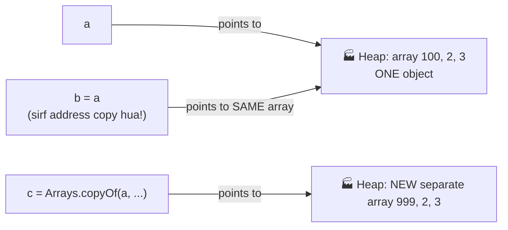

# 06 — Arrays: Many Values, One Name

> Store 100 students' marks — 100 variables? ❌ One array ✅. Arrays are THE most important topic for coding questions.

---

## 1. What is an Array? (Simple words)

An array = a **row of boxes** in memory, all of the **same type**, under **one name**. Each box has a number called an **index**, starting from **0**.

### 🏭 Analogy: Train coaches 🚂
One train (array name), many coaches (elements), each coach has a number (index). Coach counting starts from 0!

```
         marks
           │
     ┌─────▼─────┬──────┬──────┬──────┬──────┐
     │    85    │  92  │  78  │  95  │  60  │
     └──────────┴──────┴──────┴──────┴──────┘
 index:    0        1      2      3      4
```

---

## 2. Creating Arrays (3 ways)

```java
// Way 1: Declare + create with size (values default to 0)
int[] marks = new int[5];

// Way 2: Declare + values directly (size auto-decided)
int[] marks2 = {85, 92, 78, 95, 60};

// Way 3: Create first, fill later
int[] arr = new int[3];
arr[0] = 10;
arr[1] = 20;
arr[2] = 30;
```

### 🧠 Memory connection (from note 02!):
`new int[5]` → array object goes to **Heap**, `marks` reference stays in **Stack**. **Arrays are objects in Java.**

### Default values (when you use `new`):
| Type | Default |
|------|---------|
| `int`, `byte`, `short`, `long` | `0` |
| `double`, `float` | `0.0` |
| `boolean` | `false` |
| `char` | `'\u0000'` (empty character) |
| `String` / objects | `null` |

---

## 3. Accessing & Changing Elements

```java
int[] marks = {85, 92, 78, 95, 60};

System.out.println(marks[0]);      // 85  (first element)
System.out.println(marks[4]);      // 60  (last element)
System.out.println(marks.length);  // 5   (total elements — no brackets!)

marks[2] = 80;                     // change index 2: 78 → 80
```

### ⚠️ Golden rules:
- First element → index `0`
- Last element → index `length - 1` (NOT `length`!)
- `marks[5]` on a size-5 array → 💥 `ArrayIndexOutOfBoundsException` (program crash)

---

## 4. Looping through Arrays (arrays + loops = ❤️)

### (a) Normal `for` — when you need the INDEX
```java
int[] marks = {85, 92, 78, 95, 60};
for (int i = 0; i < marks.length; i++) {
    System.out.println("Student " + (i + 1) + ": " + marks[i]);
}
```

### (b) Enhanced `for-each` — when you just need VALUES (cleaner)
```java
for (int m : marks) {
    System.out.println(m);
}
```
Read it as: **"for each value m in marks"**.

💡 Use `for-each` for simple reading; use normal `for` when you need index or want to modify elements.

---

## 5. Classic array operations (must-know patterns)

### Sum & Average
```java
int[] arr = {10, 20, 30, 40};
int sum = 0;
for (int x : arr) sum += x;
System.out.println("Sum: " + sum);              // 100
System.out.println("Avg: " + (double) sum / arr.length);  // 25.0
```

### Maximum element (VERY common question)
```java
int[] arr = {23, 67, 12, 89, 45};
int max = arr[0];                    // assume first is max
for (int i = 1; i < arr.length; i++) {
    if (arr[i] > max) max = arr[i];  // found bigger? update!
}
System.out.println(max);             // 89
```

### 🔍 Dry run of max:
| i | arr[i] | max before | arr[i] > max? | max after |
|---|--------|------------|---------------|-----------|
| 1 | 67 | 23 | ✅ | 67 |
| 2 | 12 | 67 | ❌ | 67 |
| 3 | 89 | 67 | ✅ | 89 |
| 4 | 45 | 89 | ❌ | 89 |

### Reverse an array (two-pointer trick — interview favourite)
```java
int[] arr = {1, 2, 3, 4, 5};
int left = 0, right = arr.length - 1;
while (left < right) {
    int temp = arr[left];    // swap using temp
    arr[left] = arr[right];
    arr[right] = temp;
    left++; right--;
}
// arr is now {5, 4, 3, 2, 1}
```

---

## 6. The Reference Trap ⚠️ (arrays are objects!)

```java
int[] a = {1, 2, 3};
int[] b = a;          // ❌ NOT a copy! b points to the SAME array
b[0] = 100;
System.out.println(a[0]);   // 100 😱 (a also changed!)
```

**Why?** From note 02: `a` and `b` are just address slips pointing to the SAME Heap object.

### 📊 See the trap vs the real copy:



**Real copy:**
```java
int[] c = java.util.Arrays.copyOf(a, a.length);   // ✅ separate copy
c[0] = 999;
System.out.println(a[0]);   // still 100 — a is safe
```

---

## 7. 2D Arrays — table / grid (rows × columns)

### 🏭 Analogy: Cinema hall seats 🎬 — Row 2, Seat 3 = `seats[2][3]`

```java
int[][] matrix = {
    {1, 2, 3},     // row 0
    {4, 5, 6},     // row 1
    {7, 8, 9}      // row 2
};

System.out.println(matrix[1][2]);   // 6 (row 1, column 2)
System.out.println(matrix.length);       // 3 (rows)
System.out.println(matrix[0].length);    // 3 (columns in row 0)
```

### Printing a 2D array (nested loops from note 05!)
```java
for (int i = 0; i < matrix.length; i++) {        // each row
    for (int j = 0; j < matrix[i].length; j++) { // each column
        System.out.print(matrix[i][j] + " ");
    }
    System.out.println();
}
```
**Output:**
```
1 2 3 
4 5 6 
7 8 9 
```

💡 **`matrix[i][j]` = row i, column j.** Outer loop rows, inner loop columns — same rule as pattern printing.

---

## 8. Common Beginner Mistakes ❌

1. `marks[5]` on size-5 array → crash. Last index = `length - 1`.
2. `marks.length()` → ❌ arrays use `.length` (no brackets). Strings use `.length()` (with brackets) — next note!
3. `int[] b = a;` thinking it's a copy → it's the SAME array.
4. Loop condition `i <= arr.length` → crash on last round. Use `i < arr.length`.
5. Forgetting arrays start at 0 — "5th element" = index 4.

---

## 9. Practice: predict the output (answers hidden)

```java
// Q1
int[] a = {5, 10, 15};
System.out.println(a[1] + a[2]);

// Q2
int[] x = new int[3];
System.out.println(x[0] + x[1]);

// Q3
int[] p = {1, 2, 3};
int[] q = p;
q[1] = 50;
System.out.println(p[1]);

// Q4
int[][] m = {{1, 2}, {3, 4}};
System.out.println(m[1][0] + m[0][1]);
```

<details>
<summary>👉 Click for answers</summary>

- **Q1:** `25` → a[1]=10, a[2]=15
- **Q2:** `0` → `new int[3]` fills with default 0s
- **Q3:** `50` → p and q are the SAME array (reference trap!)
- **Q4:** `5` → m[1][0]=3, m[0][1]=2

</details>

---

## 10. Quick Revision (30 seconds) ⚡

- Array = same-type boxes, one name, index starts at **0**, last index = `length - 1`.
- Arrays are **objects** → live in Heap; `arr.length` (no brackets).
- `for-each` for reading, normal `for` for index/modify.
- `b = a` copies the ADDRESS, not the array. Use `Arrays.copyOf` for real copy.
- 2D: `m[row][col]`, outer loop = rows, inner = columns.
- Out of range index → `ArrayIndexOutOfBoundsException`.

---

⬅️ **Previous:** [05 — Control Flow](05-control-flow.md) | ➡️ **Next:** 07 — Strings (coming soon)
