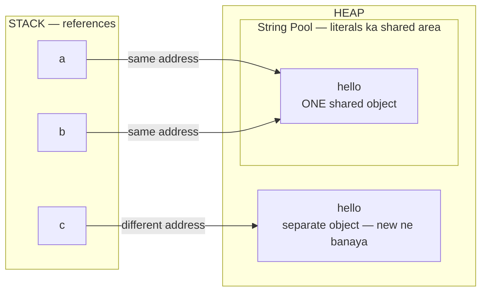

# 07 — Strings: Working With Text

> Names, messages, passwords, file paths — everything is text. Strings are used in EVERY program and asked in EVERY exam/interview.

---

## 1. What is a String? (Simple words)

A String = a **sequence of characters** (letters, digits, spaces, symbols) inside **double quotes**.

```java
String name = "Ashu Dhanda";
```

Think of it as a **char array with superpowers**:

```
 index:   0     1     2     3
        ┌─────┬─────┬─────┬─────┐
        │ 'J' │ 'a' │ 'v' │ 'a' │     → "Java"
        └─────┴─────┴─────┴─────┘
```

Index 0 se start — exactly like arrays (note 06)!

---

## 2. Strings are IMMUTABLE (the most important concept!)

**Immutable = once created, a String can NEVER be changed.**

```java
String s = "hello";
s.toUpperCase();          // makes a NEW string "HELLO", but...
System.out.println(s);    // hello 😱 (s did NOT change!)

s = s.toUpperCase();      // ✅ catch the new string back in s
System.out.println(s);    // HELLO
```

### 🏭 Analogy: Printed page 📄
A String is like a **printed page** — you can't edit it. "Changing" it means **printing a NEW page**. The old page stays in memory until Garbage Collector picks it up (note 02!).

💡 **Rule:** String methods NEVER change the original — they RETURN a new String. Always catch the result: `s = s.method();`

---

## 3. Must-Know String Methods (the top 12)

```java
String s = "Java Programming";
```

| Method | What it does | Example | Result |
|--------|--------------|---------|--------|
| `s.length()` | count characters | `s.length()` | `16` |
| `s.charAt(i)` | character at index i | `s.charAt(0)` | `'J'` |
| `s.toUpperCase()` | all capital | `"abc".toUpperCase()` | `"ABC"` |
| `s.toLowerCase()` | all small | `"ABC".toLowerCase()` | `"abc"` |
| `s.indexOf("a")` | first position of "a" | `s.indexOf("a")` | `1` |
| `s.substring(0, 4)` | cut a piece (0 to 3) | `s.substring(0, 4)` | `"Java"` |
| `s.contains("gram")` | is "gram" inside? | | `true` |
| `s.replace('a', 'o')` | replace characters | `"Java".replace('a','o')` | `"Jovo"` |
| `s.trim()` | remove spaces from ends | `"  hi  ".trim()` | `"hi"` |
| `s.split(" ")` | break into array | `s.split(" ")` | `["Java", "Programming"]` |
| `s.isEmpty()` | is it ""? | `"".isEmpty()` | `true` |
| `s.equals(t)` | compare content | see below ⬇️ | |

### ⚠️ `substring(start, end)` — start INCLUDED, end EXCLUDED
`"JavaProgramming".substring(0, 4)` → index 0,1,2,3 → `"Java"` (index 4 not included!)

### ⚠️ Arrays vs Strings (classic confusion from note 06):
- Array → `arr.length` (no brackets)
- String → `s.length()` (with brackets — it's a method!)

---

## 4. `==` vs `.equals()` — THE most famous String trap 🚨

```java
String a = "hello";
String b = "hello";
String c = new String("hello");

System.out.println(a == b);        // true  (both point to same pool object)
System.out.println(a == c);        // false 😱 (c is a separate object in Heap)
System.out.println(a.equals(c));   // true  ✅ (content is same)
```

### 📊 Why? String Pool! (ye diagram sab clear kar dega):



- `"hello"` literals go into a special Heap area called the **String Pool** — same text = same object reused (memory saving). Isliye `a == b` → **true**.
- `new String(...)` FORCES a new object outside the pool. Isliye `a == c` → **false**.
- `==` compares **addresses** (same object?), `.equals()` compares **content** (same text?).

💡 **GOLDEN RULE: Strings ko hamesha `.equals()` se compare karo, kabhi `==` se nahi.**

```java
if (password.equals("secret123")) { ... }   // ✅ correct
if (password == "secret123") { ... }        // ❌ bug waiting to happen
```

---

## 5. Looping through a String (needed in 90% string questions)

```java
String s = "hello";
for (int i = 0; i < s.length(); i++) {
    char c = s.charAt(i);
    System.out.println("Index " + i + ": " + c);
}
```

### Classic pattern: count vowels
```java
String s = "programming";
int vowels = 0;
for (int i = 0; i < s.length(); i++) {
    char c = s.charAt(i);
    if (c == 'a' || c == 'e' || c == 'i' || c == 'o' || c == 'u') vowels++;
}
System.out.println(vowels);   // 3 (o, a, i)
```

💡 `char` compare with `==` is FINE (char is primitive). Only String needs `.equals()`.

---

## 6. String Concatenation & the Performance Trap

```java
String name = "Ashu";
int age = 20;
System.out.println(name + " is " + age);   // Ashu is 20
```

### ⚠️ The `+` order trap:
```java
System.out.println(1 + 2 + "A");   // "3A"  (1+2 first, then +"A")
System.out.println("A" + 1 + 2);   // "A12" (left to right, all become text)
```

### StringBuilder — when you build strings in a LOOP

String is immutable → `s += x` in a loop creates a NEW object every round → slow for big loops!

```java
StringBuilder sb = new StringBuilder();
for (int i = 1; i <= 5; i++) {
    sb.append(i).append(",");    // modifies SAME object — fast ✅
}
System.out.println(sb.toString());   // 1,2,3,4,5,
```

**Bonus:** `sb.reverse()` — reverses in one line! (Interviewer: "reverse without reverse()" — tab loop use karna 😄)

| | `String` | `StringBuilder` |
|--|----------|------------------|
| Changeable? | ❌ immutable | ✅ mutable |
| Speed in loops | slow | fast |
| Use when | normal text work | building text in loops |

---

## 7. Classic String Questions (patterns you MUST know)

### Reverse a string
```java
String s = "hello";
String rev = "";
for (int i = s.length() - 1; i >= 0; i--) {
    rev += s.charAt(i);
}
System.out.println(rev);   // olleh
```

### Palindrome check (same forwards & backwards: "madam", "level")
```java
String s = "madam";
boolean isPalindrome = true;
int left = 0, right = s.length() - 1;      // two-pointer (note 06 trick!)
while (left < right) {
    if (s.charAt(left) != s.charAt(right)) {
        isPalindrome = false;
        break;
    }
    left++; right--;
}
System.out.println(isPalindrome);   // true
```

---

## 8. Common Beginner Mistakes ❌

1. Comparing strings with `==` → use `.equals()` ALWAYS.
2. `s.toUpperCase();` without catching result → s unchanged (immutable!).
3. `s.length` without brackets → ❌ String needs `()`; arrays don't.
4. `s.charAt(s.length())` → crash! Last index = `length() - 1`.
5. `substring(2, 5)` expecting index 5 included → end is EXCLUDED.
6. Building strings with `+` in big loops → use `StringBuilder`.

---

## 9. Practice: predict the output (answers hidden)

```java
// Q1
String s = "Java";
s.concat(" Rocks");
System.out.println(s);

// Q2
System.out.println("Hello".substring(1, 3));

// Q3
String a = "hi";
String b = new String("hi");
System.out.println((a == b) + " " + a.equals(b));

// Q4
System.out.println(2 + 3 + "5" + 2 + 3);
```

<details>
<summary>👉 Click for answers</summary>

- **Q1:** `Java` — immutable! concat's result was not caught.
- **Q2:** `el` — index 1,2 (3 excluded).
- **Q3:** `false true` — different objects, same content.
- **Q4:** `5523` — 2+3=5 (numbers), then "5"+"5"="55", +2 → "552", +3 → "5523".

</details>

---

## 10. Quick Revision (30 seconds) ⚡

- String = text in double quotes; index from 0; `length()` WITH brackets.
- **Immutable** — methods return NEW strings; always catch: `s = s.method();`
- Compare with `.equals()`, NEVER `==` (pool + address story).
- `substring(start, end)` — end excluded.
- Loop + `charAt(i)` = base of most string questions.
- Loops me string banana ho → `StringBuilder` (fast, mutable, `.reverse()` bonus).

---

⬅️ **Previous:** [06 — Arrays](06-arrays.md) | ➡️ **Next:** 08 — Methods & Method Overloading (coming soon)
