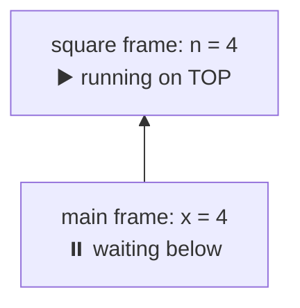
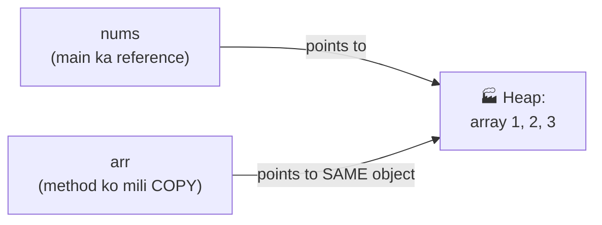
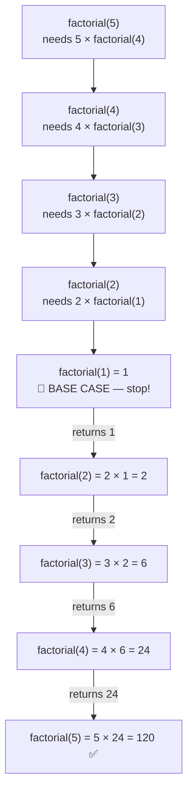

# 08 — Methods: Reusable Blocks of Code

> Same code baar-baar likhna? ❌ Ek method banao, jitni baar chahiye call karo ✅. Methods = the building blocks of clean code.

---

## 1. What is a Method? (Simple words)

A method = a **named block of code** that does ONE job. You write it once, and **call** it whenever needed.

### 🏭 Analogy: A juicer machine 🧃
- You put fruits IN (**input / parameters**)
- Machine does its work (**method body**)
- Juice comes OUT (**return value**)

Same machine, use it 100 times — that's a method!

---

## 2. Anatomy of a Method (every part explained)

```java
public static int add(int a, int b) {
    int sum = a + b;
    return sum;
}
```

| Part | Name | Meaning |
|------|------|---------|
| `public` | access modifier | who can use it (details in OOP notes) |
| `static` | keyword | callable without object (for now: main se directly call karne ke liye) |
| `int` | **return type** | what type of value comes OUT (`void` = nothing) |
| `add` | **method name** | small letter start, verb-like: `add`, `printMenu`, `findMax` |
| `(int a, int b)` | **parameters** | inputs the method needs |
| `return sum;` | **return statement** | send the answer back & EXIT the method |

### Calling it:
```java
public static void main(String[] args) {
    int result = add(5, 3);          // call → result = 8
    System.out.println(add(10, 20)); // 30 — call inside println also works
}
```

💡 **Parameters vs Arguments:** definition me likhe naam = **parameters** (`a`, `b`); call karte time bheji values = **arguments** (`5`, `3`).

---

## 3. The 4 method flavours

```java
// 1. No input, no output
static void sayHello() {
    System.out.println("Hello!");
}

// 2. Input, no output
static void greet(String name) {
    System.out.println("Hello, " + name + "!");
}

// 3. No input, output
static int getLuckyNumber() {
    return 7;
}

// 4. Input + output (most common!)
static int square(int n) {
    return n * n;
}
```

**Rule of thumb:** kuch WAPIS chahiye → return type do. Sirf print/action karna hai → `void`.

### ⚠️ `return` vs `print` (beginner confusion #1)
```java
static int square(int n) { return n * n; }   // gives value BACK → reusable
static void printSquare(int n) { System.out.println(n * n); }  // just shows on screen

int x = square(5) + 10;        // ✅ 25+10 = 35, value ko aage use kar sakte ho
int y = printSquare(5) + 10;   // ❌ ERROR! void returns nothing
```

---

## 4. How methods run in memory (Stack connection — note 02!)

```java
static int square(int n) { return n * n; }

public static void main(String[] args) {
    int x = 4;
    int result = square(x);
    System.out.println(result);   // 16
}
```

**What happens internally:**
```
Step 1: main() starts        → main's frame on Stack (x = 4)
Step 2: square(4) called     → NEW frame on TOP (n = 4)
Step 3: square returns 16    → square's frame REMOVED
Step 4: 16 stored in result  → back in main's frame
```

### 📊 Stack during step 2 (read bottom to top — plates!):



💡 Yehi wajah hai ki **infinite recursion → StackOverflowError** (note 02 se) — frames stack pe bharte jaate hain!

---

## 5. Pass by Value — Java's rule (important!)

**Java ALWAYS passes a COPY of the variable.**

### Primitives: original safe ✅
```java
static void change(int num) { num = 100; }

int a = 5;
change(a);
System.out.println(a);   // 5 — unchanged! (copy modify hui, original nahi)
```

### Arrays/objects: contents CAN change ⚠️
```java
static void changeArr(int[] arr) { arr[0] = 100; }

int[] nums = {1, 2, 3};
changeArr(nums);
System.out.println(nums[0]);   // 100 😱 — changed!
```

### 📊 Why? Copy bhi USI object ko point karti hai:



**Why?** Reference ki COPY jaati hai — but copy bhi USI Heap object ko point karti hai (note 06 ka reference trap, same funda!). Address ki photocopy se bhi ghar wahi milta hai 🏠

---

## 6. Method Overloading — same name, different inputs

**Overloading = ek hi naam ke multiple methods, bas parameters alag.**

```java
static int add(int a, int b)          { return a + b; }
static int add(int a, int b, int c)   { return a + b + c; }
static double add(double a, double b) { return a + b; }

add(2, 3);        // → 5     (int, int wala)
add(2, 3, 4);     // → 9     (3 parameters wala)
add(2.5, 3.5);    // → 6.0   (double wala)
```

Java automatically decides **arguments dekh kar** ki kaunsa version call hoga.

### 🏭 Analogy: `System.out.println()` khud overloaded hai!
`println(int)`, `println(String)`, `println(double)`, `println(boolean)`... isliye tum kuch bhi print kar paate ho 😄

### Rules of overloading:
| Change | Overloading valid? |
|--------|-----------------|
| Number of parameters different | ✅ |
| Type of parameters different | ✅ |
| Order of types different (`int,double` vs `double,int`) | ✅ |
| ONLY return type different | ❌ compile error! |

```java
static int calc(int a)    { return a; }
static double calc(int a) { return a; }   // ❌ ERROR — sirf return type alag
```

---

## 7. Recursion (intro) — method calling itself

```java
static int factorial(int n) {
    if (n <= 1) return 1;            // base case — STOP condition
    return n * factorial(n - 1);     // smaller problem
}

System.out.println(factorial(5));    // 120
```

### 📊 How it unfolds — going DOWN, then answers coming back UP:



```
factorial(5) = 5 × factorial(4)
             = 5 × 4 × factorial(3)
             = 5 × 4 × 3 × factorial(2)
             = 5 × 4 × 3 × 2 × factorial(1)
             = 5 × 4 × 3 × 2 × 1 = 120
```

⚠️ **Base case bhoole → infinite recursion → StackOverflowError.** (Ab tumhe pata hai KYU — section 4!)

💡 Recursion deep topic hai — abhi bas concept samjho, questions section me practice karenge.

---

## 8. Common Beginner Mistakes ❌

1. Return type `int` likha but `return` statement hi nahi → compile error.
2. `void` method ka result variable me store karna → error.
3. `return` ke BAAD code likhna → unreachable code error.
4. Sirf return type badal ke overload karna → ❌ not allowed.
5. Recursion me base case bhoolna → StackOverflowError.
6. Method ke andar wala variable bahar use karna → error (local variable sirf apne method me zinda hai — scope).

---

## 9. Practice: predict the output (answers hidden)

```java
static int mystery(int n) {
    if (n == 0) return 0;
    return n % 10 + mystery(n / 10);
}

static void update(int x, int[] arr) {
    x = 50;
    arr[0] = 50;
}

public static void main(String[] args) {
    // Q1
    System.out.println(mystery(123));

    // Q2
    int a = 5;
    int[] b = {5};
    update(a, b);
    System.out.println(a + " " + b[0]);

    // Q3 — which add is called?
    System.out.println(add(3, 4.0));
}
static double add(double x, double y) { return x + y; }
static int add(int x, int y) { return x + y; }
```

<details>
<summary>👉 Click for answers</summary>

- **Q1:** `6` — sum of digits via recursion: 3 + 2 + 1 (note 04 ke `%10`, `/10` tricks!)
- **Q2:** `5 50` — primitive copy (a safe), array reference (contents changed)
- **Q3:** `7.0` — `4.0` is double, so `add(double, double)` chala; 3 auto-widens to 3.0 (note 03 widening!)

</details>

---

## 10. Quick Revision (30 seconds) ⚡

- Method = named reusable block: `returnType name(parameters) { body }`.
- `return` = value wapis + exit; `void` = kuch wapis nahi.
- Har call ka Stack pe naya frame; method ends → frame removed.
- **Pass by value:** primitives safe; array/object contents change ho sakte hain.
- **Overloading:** same name, different parameters (count/type/order). Sirf return type alag = ❌.
- Recursion = khud ko call; base case zaroori warna StackOverflowError.

---

⬅️ **Previous:** [07 — Strings](07-strings.md) | ➡️ **Next:** 09 — OOP 1: Classes & Objects (coming soon)
