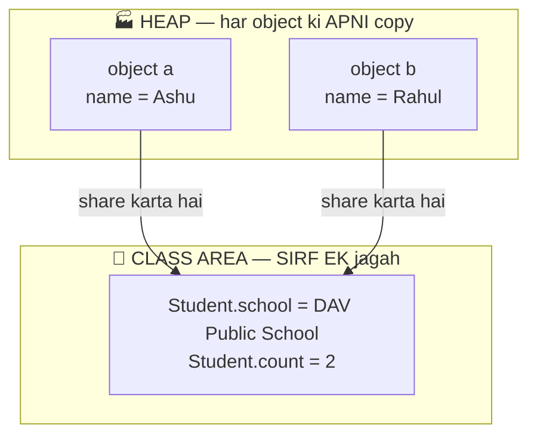

# 10 — OOP 2: Constructors, `this` & `static`

> Note 09 me object banane ke baad fields SET karni padti thi (s1.name = ..., s1.roll = ...). Boring + error-prone. Constructor se object READY-MADE milta hai. Plus aaj `static` ka mystery bhi solve hoga (note 01 ka promise!).

---

## 1. What is a Constructor? (Simple words)

Constructor = **special method jo object bante hi AUTOMATICALLY chalta hai** — object ko setup/initialize karne ke liye.

### Rules (sirf 3):
1. Naam **exactly class ke naam jaisa** hota hai.
2. **Return type NAHI hota** (void bhi nahi!).
3. `new` likhte hi khud chal jaata hai — tum call nahi karte.

```java
class Student {
    String name;
    int roll;

    // Constructor
    Student(String n, int r) {
        name = n;
        roll = r;
        System.out.println("Student created!");
    }
}

// Usage:
Student s1 = new Student("Ashu", 1);    // "Student created!" prints automatically
System.out.println(s1.name);            // Ashu — ready-made object!
```

### 📊 Kya hota hai `new` likhte hi:


### 🏭 Analogy: New phone ka setup wizard 📱
Naya phone kholte hi setup screen AUTOMATICALLY aati hai (language, wifi, account). Tum manually har setting dhundh ke set nahi karte. Constructor = wohi setup wizard — object bante hi zaroori cheezein set.

---

## 2. Default Constructor — the invisible one

```java
class Box { int value; }

Box b = new Box();   // Box() constructor kahan se aaya? Humne likha hi nahi!
```

**Answer:** Tum koi constructor nahi likhte → Java khud ek **empty default constructor** de deta hai (isliye note 09 me `new Student()` chala tha).

### ⚠️ TRAP: Apna constructor likha → default GAYAB!

```java
class Student {
    String name;
    Student(String n) { name = n; }     // apna constructor likha
}

Student s = new Student();    // ❌ ERROR! No-arg constructor ab exist nahi karta
Student s = new Student("Ashu");   // ✅
```

---

## 3. Constructor Overloading (note 08 ka overloading — constructors pe!)

```java
class Student {
    String name;
    int roll;
    double marks;

    Student() {                              // no-arg
        name = "Unknown"; roll = 0; marks = 0.0;
    }
    Student(String n, int r) {               // 2 args
        name = n; roll = r; marks = 0.0;
    }
    Student(String n, int r, double m) {     // full
        name = n; roll = r; marks = m;
    }
}

Student a = new Student();                       // Unknown, 0, 0.0
Student b = new Student("Ashu", 1);              // Ashu, 1, 0.0
Student c = new Student("Priya", 3, 92.0);       // Priya, 3, 92.0
```

Java arguments dekh ke decide karta hai kaunsa constructor chale — same as method overloading.

---

## 4. `this` keyword — "main khud" (the current object)

### Problem: parameter ka naam field jaisa ho toh?

```java
class Student {
    String name;

    Student(String name) {
        name = name;     // ❌ CONFUSION! parameter = parameter (field untouched, null rehta hai!)
    }
}
```

### Solution: `this`

```java
class Student {
    String name;

    Student(String name) {
        this.name = name;     // ✅ "MERA name = aaya hua name"
    }
}
```

**`this` = jo object abhi ban raha hai / method chala raha hai, WOH khud.**

### 🏭 Analogy:
Class me 2 log ka naam Ashu hai. Teacher bole "Ashu khada ho" → confusion. Ek Ashu bole **"MAIN"** (this) → clear! `this.name` = "MERA name", not "parameter wala name".

### Bonus: `this()` — ek constructor se doosra call karo

```java
Student() {
    this("Unknown", 0);      // full constructor ko call kar diya — no duplicate code!
}
Student(String name, int roll) {
    this.name = name; this.roll = roll;
}
```
⚠️ `this()` hamesha constructor ki **pehli line** honi chahiye.

---

## 5. `static` — class ki cheez, object ki nahi (finally!)

**Instance variable = har object ki APNI copy. Static variable = SIRF EK copy, poori class ki SHARED.**

```java
class Student {
    String name;                 // instance — har student ka apna
    static String school = "DAV Public School";   // static — SAB ka common
    static int count = 0;        // kitne students bane? (shared counter)

    Student(String name) {
        this.name = name;
        count++;                 // har naya object counter badhata hai
    }
}

Student a = new Student("Ashu");
Student b = new Student("Rahul");

System.out.println(Student.school);   // DAV Public School (class ke naam se access!)
System.out.println(Student.count);    // 2 — dono objects ne SAME counter badhaya
```

### 🏭 Analogy: Classroom ka blackboard 📝
- Har student ki **apni notebook** = instance variables (sabki alag)
- Classroom ka **blackboard EK hai** = static variable (sab share karte hain, ek ne badla toh sabke liye badla)

### 📊 Memory picture — instance vs static:



### Static methods

```java
class MathHelper {
    static int square(int n) { return n * n; }    // object ki zaroorat nahi
}

MathHelper.square(5);    // ✅ direct class se call — no new needed!
```

- **Static method me `this` aur instance variables use NAHI kar sakte** (kyunki koi object hai hi nahi!).
- Real examples: `Math.sqrt()`, `Math.max()`, `Integer.parseInt()` — sab static!

### 🎉 Note 01 ka promise poora: `public static void main` me `static` KYU?
**Kyunki JVM ko program START karna hai bina koi object banaye!** Agar main static na hota, toh JVM object kaise banata — chicken-and-egg problem. Ab samajh aaya na 😄

### Instance vs Static — final table:

| | Instance | Static |
|--|----------|--------|
| Copy | har object ki apni | poori class me EK |
| Access | `object.field` | `ClassName.field` |
| Memory | Heap (object ke saath) | Class area (ek baar) |
| `this` allowed? | ✅ | ❌ |
| Example | `name`, `roll` | `count`, `Math.PI` |

---

## 6. Full example — everything together

```java
class BankAccount {
    String holder;
    double balance;
    static int totalAccounts = 0;
    static String bankName = "SBI";

    BankAccount(String holder) {
        this(holder, 0.0);               // this() chaining
    }
    BankAccount(String holder, double balance) {
        this.holder = holder;
        this.balance = balance;
        totalAccounts++;
    }
    void deposit(double amount) {
        if (amount > 0) this.balance += amount;
    }
    void showInfo() {
        System.out.println(holder + " @ " + bankName + ": ₹" + balance);
    }
}

public class Main {
    public static void main(String[] args) {
        BankAccount acc1 = new BankAccount("Ashu", 5000);
        BankAccount acc2 = new BankAccount("Rahul");

        acc1.deposit(2000);
        acc1.showInfo();     // Ashu @ SBI: ₹7000.0
        acc2.showInfo();     // Rahul @ SBI: ₹0.0
        System.out.println("Total accounts: " + BankAccount.totalAccounts);  // 2
    }
}
```

---

## 7. Common Beginner Mistakes ❌

1. Constructor pe return type lagana: `void Student() {...}` → ye constructor NAHI, normal method ban gaya!
2. Apna constructor likhne ke baad `new Student()` expect karna → default gayab ho chuka.
3. `name = name;` (bina this) → field null/0 reh jaati hai — classic silent bug!
4. Static method me instance variable use karna → compile error.
5. Static ko object se access karna (`a.count`) → chalta hai but confusing; `Student.count` likho.
6. `this()` ko constructor ki pehli line ke alawa kahin aur likhna → error.

---

## 8. Practice: predict the output (answers hidden)

```java
class Counter {
    static int total = 0;
    int mine = 0;

    Counter() {
        total++;
        mine++;
    }
}

public class Main {
    public static void main(String[] args) {
        Counter a = new Counter();
        Counter b = new Counter();
        Counter c = new Counter();
        // Q1
        System.out.println(a.mine + " " + Counter.total);

        // Q2 — kya print hoga?
        System.out.println(b.mine + " " + c.mine);
    }
}

// Q3 — is class me kya problem hai?
class Person {
    String name;
    void Person(String name) { this.name = name; }
}
// Person p = new Person("Ashu");  ← chalega?
```

<details>
<summary>👉 Click for answers</summary>

- **Q1:** `1 3` — `mine` har object ka apna (1), `total` shared (3 objects = 3)
- **Q2:** `1 1` — har object ka `mine` sirf apne constructor me ek baar badha
- **Q3:** ❌ `new Person("Ashu")` FAIL hoga — `void` lagane se wo constructor nahi, method ban gaya. String-arg constructor exist hi nahi karta!

</details>

---

## 9. Quick Revision (30 seconds) ⚡

- Constructor: class ke naam jaisa, NO return type, `new` pe auto-run.
- Apna constructor likha → default constructor gayab.
- Constructor overloading = same as method overloading.
- `this.field` = "MERA field"; `this()` = doosra constructor call (first line only).
- `static` = class ki cheez, EK copy, `ClassName.` se access. Static method me `this`/instance vars ❌.
- `main` static hai taaki JVM bina object ke program start kar sake.

---

⬅️ **Previous:** [09 — OOP 1: Classes & Objects](09-oop1-classes-objects.md) | ➡️ **Next:** 11 — OOP 3: Inheritance & Polymorphism (coming soon)
