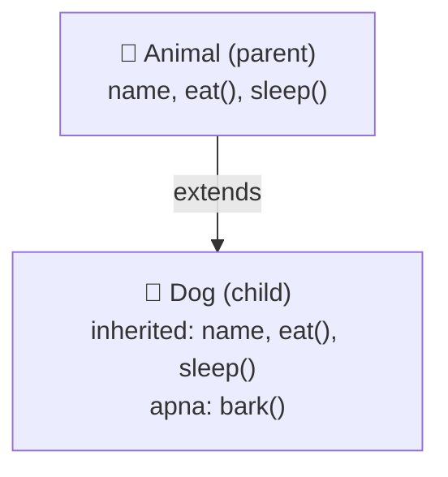
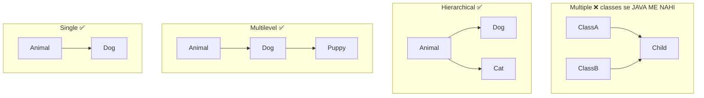
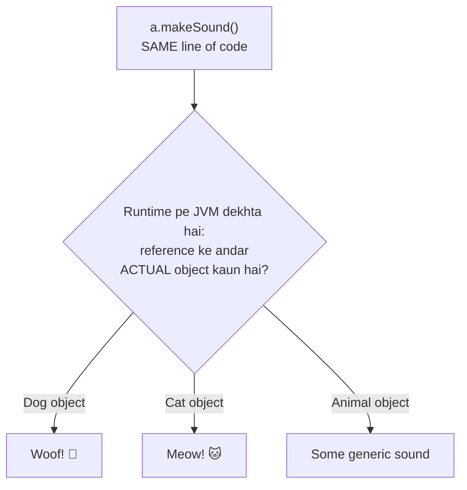

# 11 — OOP 3: Inheritance & Polymorphism (Interview Favourites 🎯)

> Do classes me same code copy-paste kar rahe ho? Inheritance bolo. Ek hi method alag-alag tarike se chale? Polymorphism bolo. Ye dono OOP ke SUPERPOWERS hain — aur interview me sabse zyada poochhe jaate hain.

---

## 1. Inheritance — "virasat" (simple words)

**Inheritance = ek class doosri class ki properties + methods LE LETI hai.** Code ek baar likho, sab jagah use karo.

### 🏭 Analogy: Papa ki property 👨‍👦
Bete ko papa se ghar, surname, business milta hai (kuch bhi dobara banana nahi padta) — PLUS bete ki apni cheezein bhi hoti hain. Beta = child class!

```java
// Parent class (super class / base class)
class Animal {
    String name;

    void eat()   { System.out.println(name + " is eating"); }
    void sleep() { System.out.println(name + " is sleeping"); }
}

// Child class (sub class) — 'extends' = inherit karo
class Dog extends Animal {
    void bark() { System.out.println(name + " says Woof! 🐶"); }
}

public class Main {
    public static void main(String[] args) {
        Dog d = new Dog();
        d.name = "Tommy";
        d.eat();     // Tommy is eating   ← Animal se mila (likha nahi, phir bhi chala!)
        d.sleep();   // Tommy is sleeping ← Animal se mila
        d.bark();    // Tommy says Woof!  ← Dog ka apna
    }
}
```

### 📊 Kya kis ko milta hai:



**`extends` = "main iska child hoon, iski sab cheezein mujhe do".**

### IS-A rule (kab inheritance use karein?)
- Dog **IS-A**n Animal ✅ → `Dog extends Animal` sahi
- Car **IS-A**n Engine? ❌ Nahi! Car **HAS-A**n Engine → inheritance NAHI, field banao (`Engine engine;`)

💡 Confusion ho toh bolo: "___ IS A ___" — sentence sahi lage toh `extends`, warna field.

---

## 2. Types of Inheritance (quick view)

### 📊 All 4 types in one picture:



⚠️ **Interview question:** "Java me multiple inheritance kyu nahi?" → **Diamond problem**: agar do parents me SAME method ho, child kiska version le? Confusion! Isliye Java ne classes ke liye ban kiya (interfaces se solution note 12 me).

---

## 3. `super` keyword — "papa wala"

`this` = main khud (note 10). **`super` = mera parent.**

```java
class Animal {
    String name;
    Animal(String name) {
        this.name = name;
        System.out.println("Animal constructor");
    }
    void makeSound() { System.out.println("Some sound..."); }
}

class Dog extends Animal {
    Dog(String name) {
        super(name);                       // parent ka constructor call — FIRST LINE!
        System.out.println("Dog constructor");
    }
    void makeSound() {
        super.makeSound();                 // parent ka method bhi chalao
        System.out.println("Woof!");       // apna kaam bhi karo
    }
}

new Dog("Tommy");
// Output:
// Animal constructor    ← pehle parent banta hai!
// Dog constructor
```

### Rules:
- **Parent constructor PEHLE chalta hai** (ghar pehle papa ka banta hai 😄).
- `super(...)` constructor ki **first line** honi chahiye (jaise `this()`).
- Nahi likha toh Java khud `super()` (no-arg) laga deta hai — par agar parent ka no-arg constructor exist nahi karta toh ❌ ERROR (note 10 ka default constructor trap yahan wapas aata hai!).

---

## 4. Method Overriding — child apna version banaye

**Overriding = parent ka method child me FIR SE likhna (same name, same parameters) — apne style me.**

```java
class Animal {
    void makeSound() { System.out.println("Some generic sound"); }
}
class Dog extends Animal {
    @Override
    void makeSound() { System.out.println("Woof! 🐶"); }
}
class Cat extends Animal {
    @Override
    void makeSound() { System.out.println("Meow! 🐱"); }
}
```

### 🏭 Analogy: Papa ki dukaan, beta naya style
Papa samosa banate the ek recipe se. Bete ne DUKAAN wahi rakhi, naam wahi, par recipe APNI use ki. Method same, implementation nayi!

### `@Override` annotation — hamesha lagao!
Ye Java ko bolta hai "main override kar raha hoon, check karna". Spelling galat hui (`makesound`) toh Java turant error dega — warna silent bug banta!

### ⚠️ Overloading vs Overriding (CLASSIC exam question):

| | Overloading (note 08) | Overriding |
|--|----------------------|------------|
| Kya | same name, **different parameters** | same name, **same parameters** |
| Kahan | **same class** me | **parent-child** classes me |
| Kab decide | compile time | run time |
| Yaad rakho | "load" = zyada versions | "ride" = replace parent's |

---

## 5. Polymorphism — "ek naam, kai roop" 🎭

**Poly = many, morph = forms.** Ek hi method call, alag-alag objects pe alag-alag behaviour!

### The magic line:
```java
Animal a = new Dog();    // Parent reference → child object. VALID!
```

Dog IS-A Animal, isliye Animal ke dabbe me Dog aa sakta hai.

### Full power example:

```java
public class Main {
    public static void main(String[] args) {
        Animal[] zoo = { new Dog(), new Cat(), new Animal() };   // note 06 ka array!

        for (Animal a : zoo) {
            a.makeSound();     // SAME line, ALAG output!
        }
    }
}
// Output:
// Woof! 🐶
// Meow! 🐱
// Some generic sound
```

### 📊 Dynamic dispatch — same call, alag result (runtime pe decide):



**Ye kaise hua?** Java RUN TIME pe dekhta hai ki reference ke andar ACTUAL object kaun hai, aur USKA method chalata hai. Isko **dynamic method dispatch** kehte hain (interview term 🎯).

### 🏭 Analogy: TV ka remote 📺
"Power" button (same method call) — Samsung TV pe Samsung on hota hai, LG pe LG. Button same, result depends on ACTUAL TV (object). Remote = reference, TV = object!

### Kya access hota hai? (important rule)

```java
Animal a = new Dog();
a.makeSound();   // ✅ Woof! (Dog ka override chala — object decide karta hai)
a.eat();         // ✅ Animal ka method
a.bark();        // ❌ ERROR! Reference Animal type ka hai — use sirf Animal ke methods dikhte hain
```

💡 **Rule: Reference type decide karta hai kya CALL kar sakte ho; object type decide karta hai kaunsa VERSION chalega.**

Bark chahiye toh cast karo:
```java
if (a instanceof Dog) {         // pehle check (safe casting)
    Dog d = (Dog) a;
    d.bark();                   // ✅
}
```

---

## 6. Real-world use — polymorphism kyu powerful hai

```java
// Ek hi method HAR shape ka area print kar deta hai — naya shape aaye toh ye code CHANGE NAHI hota!
static void printArea(Shape s) {
    System.out.println("Area: " + s.area());
}

class Shape     { double area() { return 0; } }
class Circle extends Shape {
    double r;
    Circle(double r) { this.r = r; }
    @Override double area() { return 3.14159 * r * r; }
}
class Square extends Shape {
    double side;
    Square(double side) { this.side = side; }
    @Override double area() { return side * side; }
}

printArea(new Circle(5));   // Area: 78.53975
printArea(new Square(4));   // Area: 16.0
// Kal Triangle aya? Bas nayi class banao — printArea() ko haath bhi nahi lagana! 🔥
```

---

## 7. Common Beginner Mistakes ❌

1. HAS-A relation pe inheritance lagana (Car extends Engine ❌) — IS-A test karo.
2. `super(...)` first line pe nahi likhna → error.
3. Parent me no-arg constructor nahi + child me `super(...)` nahi likha → confusing error.
4. `@Override` nahi lagana → spelling mistake pe silent bug (override hi nahi hua!).
5. `Animal a = new Dog(); a.bark();` → ❌ reference type Animal hai, bark nahi dikhta.
6. Overloading aur Overriding ko mix karna — upar wali table yaad karo!
7. Bina `instanceof` check kiye cast karna → `ClassCastException` crash.

---

## 8. Practice: predict the output (answers hidden)

```java
class A {
    A() { System.out.println("A born"); }
    void show() { System.out.println("A show"); }
}
class B extends A {
    B() { System.out.println("B born"); }
    @Override
    void show() { System.out.println("B show"); }
    void extra() { System.out.println("B extra"); }
}

public class Main {
    public static void main(String[] args) {
        // Q1
        B b = new B();

        // Q2
        A a = new B();
        a.show();

        // Q3 — compile hoga?
        // a.extra();

        // Q4
        System.out.println(a instanceof A);
        System.out.println(a instanceof B);
    }
}
```

<details>
<summary>👉 Click for answers</summary>

- **Q1:** `A born` then `B born` — parent constructor PEHLE chalta hai
- **Q2:** `B show` — object B ka hai, toh B ka override chala (dynamic dispatch!)
- **Q3:** ❌ Compile error — reference type A me `extra()` exist nahi karta
- **Q4:** `true` aur `true` — B object, B bhi hai aur (IS-A rule se) A bhi!

</details>

---

## 9. Quick Revision (30 seconds) ⚡

- `extends` = inherit; IS-A test pass ho tabhi use karo (HAS-A → field).
- Java me classes se multiple inheritance ❌ (diamond problem) — interfaces se ✅ (note 12).
- `super()` = parent constructor (first line); parent PEHLE banta hai.
- Overriding = same signature, child me nayi body; `@Override` hamesha lagao.
- Overloading = compile time, same class. Overriding = run time, parent-child.
- `Animal a = new Dog()` → call reference type se, version object type se.
- Cast se pehle `instanceof` check karo.

---

⬅️ **Previous:** [10 — OOP 2: Constructors, this, static](10-oop2-constructors-this-static.md) | ➡️ **Next:** 12 — OOP 4: Abstraction & Interfaces (coming soon)
