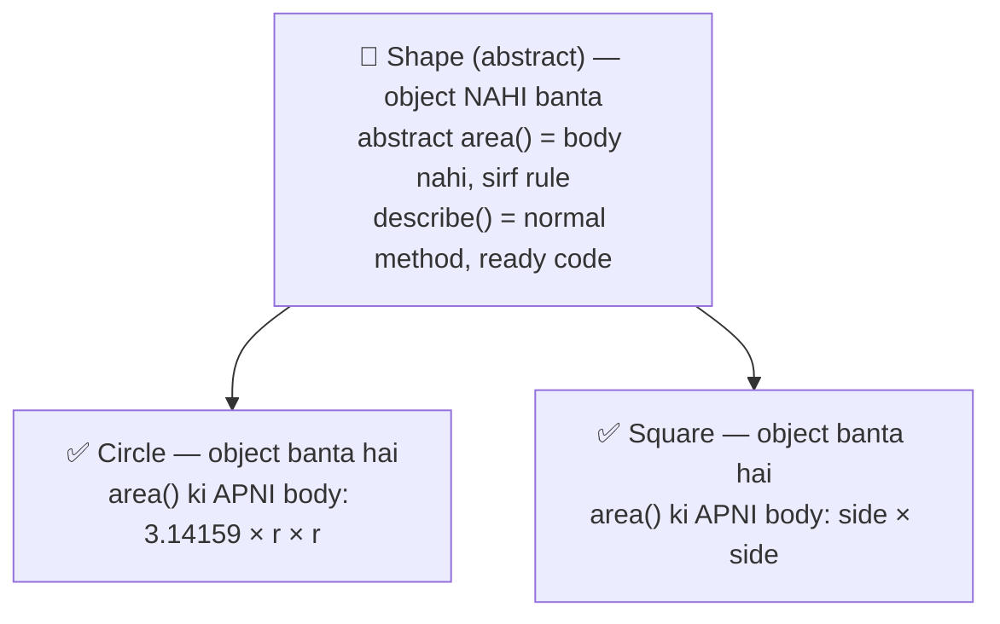
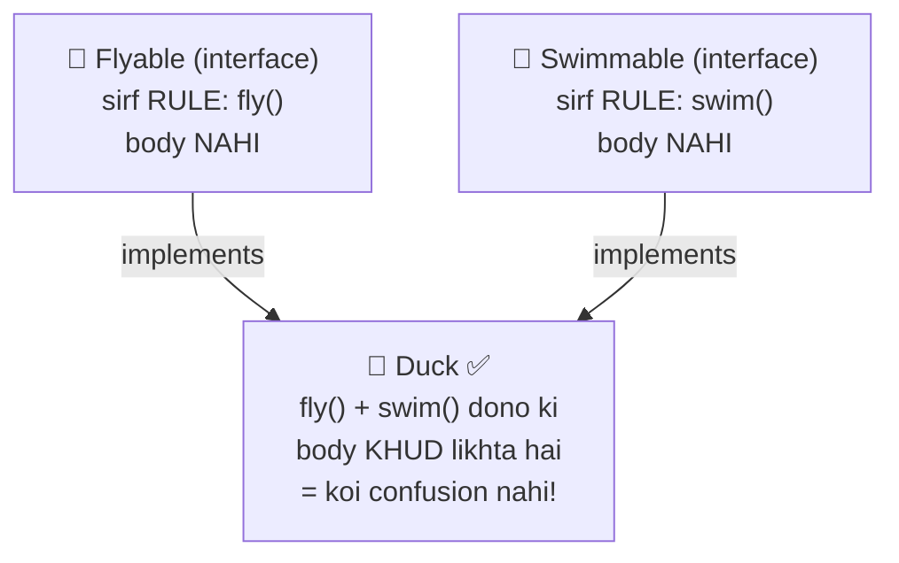
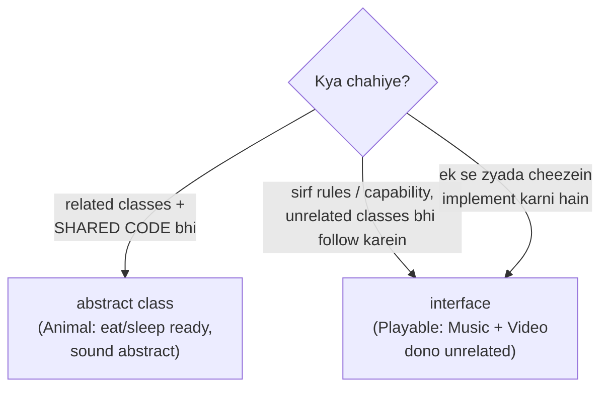

# 12 — OOP 4: Abstraction & Interfaces (OOP Series Finale 🏁)

> Car chalate ho toh sirf steering, brake, accelerator dikhta hai — engine ke andar kya ho raha hai, tumhe farak nahi padta. Yehi **abstraction** hai: sirf ZAROORI cheez dikhao, complexity chhupao.

---

## 1. Abstraction — simple words

**Abstraction = KYA karna hai wo dikhao, KAISE hota hai wo chhupao.**

### 🏭 Analogy: ATM machine 🏧
- Tum dekhte ho: "Withdraw", "Check Balance" buttons (**WHAT**)
- Andar kya hota hai: bank servers, security checks, cash counting (**HOW** — hidden!)

Tum ATM use kar lete ho bina banking system samjhe. Code me bhi same — user ko simple interface do, complexity chhupao.

### Java me abstraction ke 2 tools:
1. **Abstract classes** (partial abstraction)
2. **Interfaces** (full abstraction)

---

## 2. Abstract Class — adhoora blueprint

Note 11 ke Shape example me problem thi:

```java
class Shape { double area() { return 0; } }   // 🤔 area() = 0? Ye galat hai!
Shape s = new Shape();                         // 🤔 "Shape" object? Kaisa shape? Bekaar!
```

**"Shape" khud koi cheez nahi hai — circle hota hai, square hota hai. Shape sirf ek CONCEPT hai.** Java me concepts ke liye: `abstract`!

```java
abstract class Shape {                  // abstract = incomplete, object NAHI ban sakta
    String name;

    abstract double area();             // abstract method = NO body! Children MUST likhein

    void describe() {                   // normal method bhi rakh sakte ho
        System.out.println(name + " area: " + area());
    }
}

class Circle extends Shape {
    double r;
    Circle(double r) { this.r = r; name = "Circle"; }

    @Override
    double area() { return 3.14159 * r * r; }     // body dena COMPULSORY
}

Shape s = new Shape();        // ❌ ERROR! Abstract class ka object nahi banta
Shape c = new Circle(5);      // ✅ Parent reference, child object (note 11!)
c.describe();                 // Circle area: 78.53975
```

### 📊 Abstract class ek nazar me:



### Abstract class rules:
| Rule | Detail |
|------|--------|
| `abstract class` ka object | ❌ kabhi nahi banta |
| Abstract method | body nahi hoti, sirf signature + `;` |
| Child class | SAB abstract methods override kare, warna khud abstract ban jaaye |
| Normal methods/fields/constructor | ✅ rakh sakte ho (isliye "partial" abstraction) |

### 🏭 Analogy: Adhoori building ka naksha 🏗️
Abstract class = aisa naksha jisme kuch floors ka design FINAL hai (normal methods) aur kuch floors pe likha hai "buyer khud design karega" (abstract methods). Aise naksha se seedha ghar nahi banta — pehle COMPLETE karna padta hai (child class)!

---

## 3. Interface — pure contract 📜

**Interface = 100% rules ki list. Sirf "KYA karna hai" — kaise karna hai, wo implement karne wali class ki marzi.**

```java
interface Playable {
    void play();      // automatically public + abstract (likhna nahi padta)
    void pause();
}

class MusicPlayer implements Playable {        // implements, not extends!
    @Override
    public void play()  { System.out.println("🎵 Music playing..."); }
    @Override
    public void pause() { System.out.println("🎵 Music paused"); }
}

class VideoPlayer implements Playable {
    @Override
    public void play()  { System.out.println("🎬 Video playing..."); }
    @Override
    public void pause() { System.out.println("🎬 Video paused"); }
}

// Polymorphism with interfaces (note 11 ka power yahan bhi!)
Playable p = new MusicPlayer();
p.play();                          // 🎵 Music playing...
```

### 🏭 Analogy: Driving license ka syllabus 😁
License lene ke liye rules FIXED hain: gaadi chalani aani chahiye, signs pata hone chahiye. HOW you learned (driving school, papa se, khud) — kisi ko farak nahi padta. **Interface = syllabus (rules), class = tumhari taiyari (implementation).**

### 🎉 Diamond problem SOLVED (note 11 ka promise!)

Classes se multiple inheritance ❌ tha, but interfaces se ✅:

```java
interface Flyable  { void fly(); }
interface Swimmable { void swim(); }

class Duck implements Flyable, Swimmable {     // DONO! Comma laga ke
    public void fly()  { System.out.println("Duck flying 🦆"); }
    public void swim() { System.out.println("Duck swimming 🏊"); }
}
```

### 📊 Kyu chalta hai? Body ka jhagda hi nahi:



**Confusion kyu nahi hota?** Interface me sirf signature hota hai, body NAHI — body toh Duck khud likhta hai. Do parents se same METHOD BODY aane ka jhagda hi nahi! 🎯

---

## 4. Abstract Class vs Interface (THE interview table 🎯)

| | Abstract Class | Interface |
|--|---------------|-----------|
| Keyword | `extends` (ek hi) | `implements` (kitne bhi!) |
| Methods | abstract + normal dono | (mostly) sab abstract |
| Fields | normal fields ✅ | sirf `public static final` (constants) |
| Constructor | ✅ hota hai | ❌ nahi hota |
| Object banana | ❌ | ❌ |
| Kab use karein | classes me COMMON CODE + kuch abstract | pure RULES/CAPABILITY define karni ho |

### 📊 Kaunsa kab? (decision flowchart)



💡 Real Java examples: `Comparable`, `Runnable` (note 15 me milega!), `List` — sab interfaces!

---

## 5. Encapsulation bonus — OOP ka 4th pillar 🛡️

OOP ke 4 pillars: **Encapsulation, Inheritance (11), Polymorphism (11), Abstraction (12)**. Encapsulation yahin nipta dete hain — sabse easy hai:

**Encapsulation = data ko `private` karke lock karo, access sirf methods (getters/setters) se do.**

```java
class BankAccount {
    private double balance;      // private = bahar se koi haath nahi laga sakta!

    public double getBalance() {              // getter — padhne ka darwaza
        return balance;
    }
    public void deposit(double amount) {      // setter with VALIDATION — yahi power hai!
        if (amount > 0) balance += amount;
        else System.out.println("Galat amount!");
    }
}

BankAccount acc = new BankAccount();
acc.balance = -50000;     // ❌ ERROR! private hai — direct access band
acc.deposit(-50000);      // "Galat amount!" — validation ne bacha liya 🛡️
acc.deposit(5000);        // ✅ legal tarika
```

### 🏭 Analogy: Medical store 💊
Dawaiyan shelf pe khuli nahi rakhi hoti (private data). Tum counter pe bolte ho, pharmacist DEKH KE deta hai — prescription check karke (validation in setter). Direct access = khatra!

### Access modifiers quick table:
| Modifier | Kaun access kar sakta hai |
|----------|--------------------------|
| `private` | sirf apni class |
| (default) | apna package |
| `protected` | package + child classes |
| `public` | sab koi |

💡 **Rule of thumb: fields `private` rakho, methods zaroorat ke hisaab se `public`.**

---

## 6. Common Beginner Mistakes ❌

1. Abstract class ka object banana → `new Shape()` ❌ compile error.
2. Abstract method ko body dena → `abstract void area() { }` ❌ — ya abstract ya body, dono nahi.
3. Interface implement karke method `public` likhna bhoolna → error (interface methods public hote hain!).
4. Saare abstract methods override nahi karna → class ko bhi `abstract` banana padega.
5. Interface me constructor dhundhna → hota hi nahi!
6. Ye sochna ki `private` field child class me dikhega → nahi! `protected` chahiye uske liye.

---

## 7. Practice: predict the output (answers hidden)

```java
abstract class Vehicle {
    Vehicle() { System.out.println("Vehicle ready"); }
    abstract void start();
    void info() { System.out.println("I am a vehicle"); }
}

class Bike extends Vehicle {
    @Override
    void start() { System.out.println("Bike: kick start! 🏍️"); }
}

interface Chargeable { void charge(); }

class EBike extends Vehicle implements Chargeable {
    @Override
    public void start()  { System.out.println("EBike: button start ⚡"); }
    @Override
    public void charge() { System.out.println("EBike charging 🔋"); }
}

public class Main {
    public static void main(String[] args) {
        // Q1
        Vehicle v = new Bike();
        v.start();

        // Q2 — kya print hoga? (constructor bhi hai!)
        Vehicle e = new EBike();

        // Q3 — compile hoga?
        // v.charge();

        // Q4 — aur ye?
        // Vehicle x = new Vehicle();
    }
}
```

<details>
<summary>👉 Click for answers</summary>

- **Q1:** `Vehicle ready` then `Bike: kick start! 🏍️` — abstract class ka constructor CHALTA hai (object child ka banta hai, par chain me parent constructor pehle — note 11!)
- **Q2:** `Vehicle ready` — sirf constructor output, start() call hi nahi kiya
- **Q3:** ❌ Error — reference type `Vehicle` me `charge()` nahi hai (note 11 ka rule: reference decides kya call hoga)
- **Q4:** ❌ Error — abstract class ka object kabhi nahi banta!

</details>

---

## 8. Quick Revision (30 seconds) ⚡

- Abstraction = WHAT dikhao, HOW chhupao (ATM style).
- `abstract class` = adhoora blueprint; object ❌; abstract + normal methods dono ✅.
- `interface` = pure contract; `implements`; multiple ✅ (diamond problem solved — body hoti hi nahi!).
- Abstract class → shared code + related classes; Interface → capability/rules, unrelated classes.
- Encapsulation = `private` fields + public getters/setters with validation.
- **OOP 4 pillars done: Encapsulation ✅ Inheritance ✅ Polymorphism ✅ Abstraction ✅** 🎉

---

⬅️ **Previous:** [11 — OOP 3: Inheritance & Polymorphism](11-oop3-inheritance-polymorphism.md) | ➡️ **Next:** 13 — Exception Handling (coming soon)
