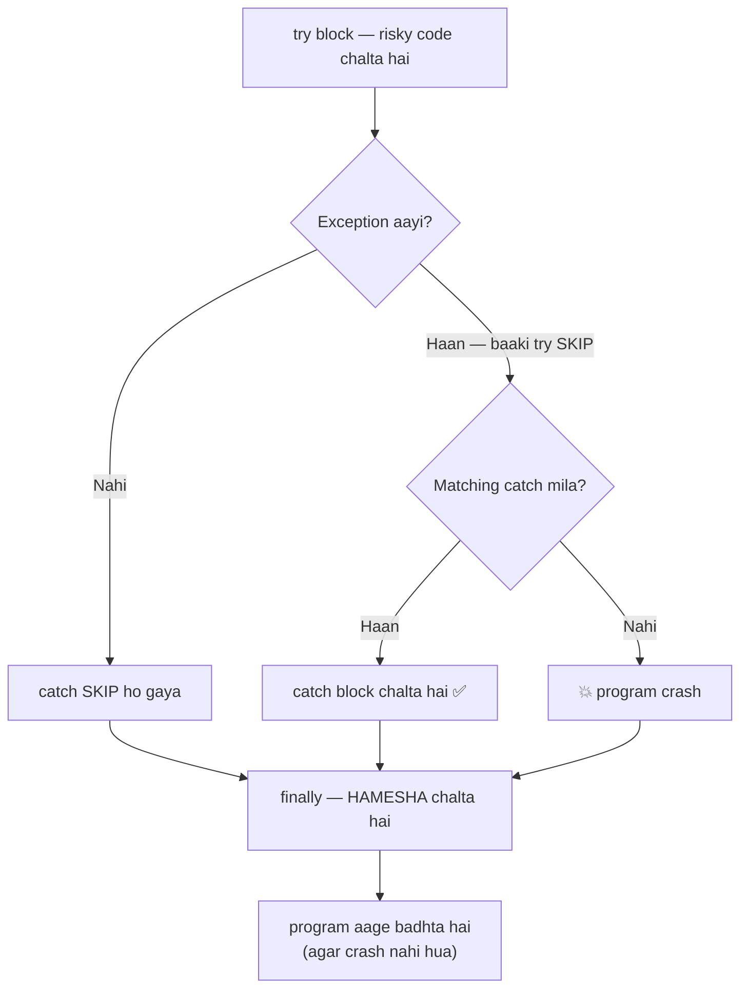
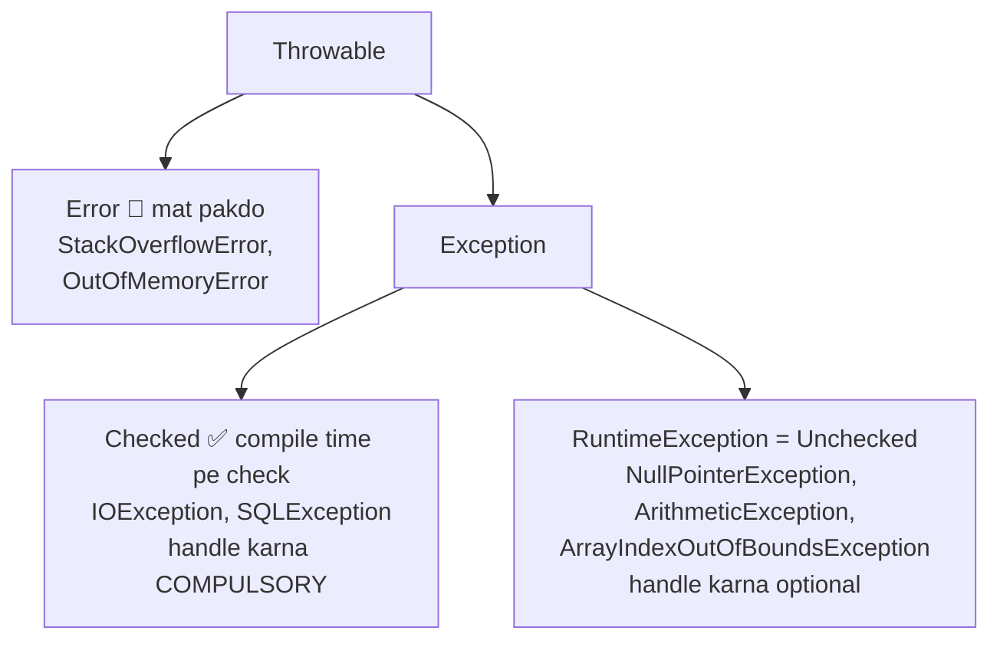

# 13 — Exception Handling: Crash Se Bachao 🛡️

> Ab tak jab bhi galti hui — `ArrayIndexOutOfBoundsException` (06), `NullPointerException` (09), `StackOverflowError` (02) — program CRASH ho gaya. Aaj seekhenge crash hone se ROKNA kaise hai.

---

## 1. Exception kya hai? (Simple words)

**Exception = program chalte-chalte koi UNEXPECTED problem** — jaise 0 se divide, galat index, null pe method call. Handle nahi kiya → program wahi RUK jaata hai (crash).

```java
int[] arr = {1, 2, 3};
System.out.println(arr[5]);              // 💥 CRASH
System.out.println("Ye line kabhi nahi chalegi");   // program yahan tak aaya hi nahi
```

### 🏭 Analogy: Bike ka puncture 🚲
Ghar se college ja rahe ho, raaste me puncture (exception). Do options:
- **No handling:** wahi baith ke rona — college kabhi nahi pahunchoge (crash 💥)
- **Handling:** stepney lagao ya mechanic dhundo (catch), aur aage badho (program continue!)

---

## 2. `try-catch` — the safety net

```java
try {
    // RISKY code yahan (jo fat sakta hai)
    int result = 10 / 0;
    System.out.println(result);          // yahan tak nahi aayega
} catch (ArithmeticException e) {
    // problem aayi toh YE chalega (crash nahi!)
    System.out.println("Bhai, 0 se divide nahi hota! " + e.getMessage());
}
System.out.println("Program zinda hai! ✅");

// Output:
// Bhai, 0 se divide nahi hota! / by zero
// Program zinda hai! ✅
```

### 📊 Poora flow ek diagram me:



**Flow:** `try` me exception aayi → baaki try SKIP → matching `catch` chala → program AAGE badha. Exception nahi aayi → catch skip.

---

## 3. Famous exceptions (sab purani notes se mile hue dost 😄)

| Exception | Kab aati hai | Kahan mili thi |
|-----------|--------------|----------------|
| `ArithmeticException` | `10 / 0` (int me) | note 04 |
| `ArrayIndexOutOfBoundsException` | `arr[5]` on size-3 array | note 06 |
| `NullPointerException` | null pe `.` lagana | note 09 |
| `NumberFormatException` | `Integer.parseInt("abc")` | — |
| `ClassCastException` | galat cast bina `instanceof` | note 11 |
| `StackOverflowError` | infinite recursion | notes 02, 08 |

```java
// NumberFormatException — user input me sabse common!
String input = "abc123";
int num = Integer.parseInt(input);    // 💥 "abc123" number nahi hai!
```

---

## 4. Multiple catch — alag problem, alag solution

```java
try {
    int[] arr = new int[3];
    arr[1] = 10 / choice;         // do risky cheezein!
} catch (ArithmeticException e) {
    System.out.println("Divide by zero!");
} catch (ArrayIndexOutOfBoundsException e) {
    System.out.println("Galat index!");
} catch (Exception e) {
    System.out.println("Koi aur problem: " + e.getMessage());
}
```

### ⚠️ Order matters! Chhota pehle, bada baad me:
`Exception` SAB exceptions ka parent hai (inheritance — note 11!). Usse PEHLE likha toh baaki catch blocks unreachable → compile error!

```java
catch (Exception e) { }                    // ❌ pehle likha toh...
catch (ArithmeticException e) { }          // ❌ ...ye kabhi nahi chalega — ERROR
```

💡 Ek jaise handling ke liye shortcut: `catch (ArithmeticException | NullPointerException e)`

---

## 5. `finally` — jo HAMESHA chalta hai

```java
try {
    int x = 10 / 0;
} catch (ArithmeticException e) {
    System.out.println("Handled!");
} finally {
    System.out.println("Main HAMESHA chalunga 💪");   // exception aaye ya na aaye!
}
```

### 🏭 Analogy: Restaurant ka bill 🍽️
Khana accha laga ya kharab (exception aayi ya nahi) — **bill toh dena hi padega** (finally). Use: file close karna, connection band karna — safai ka kaam.

---

## 6. `throw` & `throws` — khud exception phenko

### `throw` — apni marzi se exception uthao:

```java
static void setAge(int age) {
    if (age < 0 || age > 150) {
        throw new IllegalArgumentException("Age " + age + " impossible hai bhai!");
    }
    System.out.println("Age set: " + age);
}

setAge(25);    // Age set: 25
setAge(-5);    // 💥 IllegalArgumentException: Age -5 impossible hai bhai!
```

Ye encapsulation (note 12) ka best friend hai — setters me validation + throw!

### `throws` — "main handle nahi karunga, aage wala kare":

```java
static void readFile() throws IOException {    // warning label: "main IOException de sakta hoon"
    // file reading code...
}

// Ab caller ki zimmedari:
try { readFile(); } catch (IOException e) { ... }
```

| | `throw` | `throws` |
|--|---------|----------|
| Kya | exception PHENKO (action) | warning DO (declaration) |
| Kahan | method ke andar | method signature me |
| Kitne | ek object | kai types (comma se) |

---

## 7. Checked vs Unchecked (interview table 🎯)

### 📊 Exception ka family tree (ye hierarchy interview me poochhi jaati hai!):



| | Checked | Unchecked |
|--|---------|-----------|
| Check kab | COMPILE time | RUN time |
| Handle karna | COMPULSORY (warna compile error) | optional |
| Examples | `IOException`, `SQLException` | `NullPointerException`, `ArithmeticException` |
| Aati kahan se | bahar ki cheezein (file, network) | tumhare code ki galtiyan |

💡 **Yaad rakhne ka trick:** Checked = "bahar wali risky cheezein" (file mil bhi sakti hai, nahi bhi) — Java pehle hi bolta hai "plan B ready rakho". Unchecked = "tumhari coding galti" — code sudharo, try-catch har jagah mat lagao!

---

## 8. Custom Exception — apni khud ki exception class!

```java
class NotEnoughBalanceException extends Exception {     // bas Exception ko extend karo
    NotEnoughBalanceException(String message) {
        super(message);                                  // note 11 ka super!
    }
}

class BankAccount {
    private double balance = 1000;

    void withdraw(double amount) throws NotEnoughBalanceException {
        if (amount > balance) {
            throw new NotEnoughBalanceException(
                "Balance sirf ₹" + balance + ", maanga ₹" + amount);
        }
        balance -= amount;
        System.out.println("₹" + amount + " withdraw ho gaya");
    }
}

// Usage:
BankAccount acc = new BankAccount();
try {
    acc.withdraw(5000);
} catch (NotEnoughBalanceException e) {
    System.out.println("❌ " + e.getMessage());
}
// Output: ❌ Balance sirf ₹1000.0, maanga ₹5000.0
```

Dekho kaise OOP ke saare concepts (inheritance, super, throw) mil ke kaam kar rahe hain! 🔥

---

## 9. Common Beginner Mistakes ❌

1. Khaali catch block: `catch (Exception e) { }` → exception CHHUP gayi, bug dhundna impossible! Kam se kam print karo.
2. Pura program ek try me daal dena → sirf RISKY lines try me rakho.
3. `Exception` ko pehle catch karna → baaki blocks unreachable.
4. Exception ko logic ke liye use karna (`try { arr[i++] } catch` se loop rokna) → ❌ loops se condition check karo!
5. `finally` me `return` likhna → try/catch ka return overwrite ho jaata hai — confusing!
6. Checked exception ignore karna → compile hi nahi hoga.

---

## 10. Practice: predict the output (answers hidden)

```java
// Q1
try {
    System.out.println("A");
    int x = 5 / 0;
    System.out.println("B");
} catch (ArithmeticException e) {
    System.out.println("C");
} finally {
    System.out.println("D");
}

// Q2
try {
    String s = null;
    System.out.println(s.length());
} catch (ArithmeticException e) {
    System.out.println("Math problem");
}

// Q3
static int test() {
    try { return 1; }
    finally { System.out.println("finally chala!"); }
}
// test() call karne pe kya print hoga?
```

<details>
<summary>👉 Click for answers</summary>

- **Q1:** `A C D` — "B" skip (exception ke baad), C = catch, D = finally hamesha
- **Q2:** 💥 CRASH! `NullPointerException` aayi thi, humne sirf `ArithmeticException` catch kiya — galat net lagaya toh machli nikal gayi 😄
- **Q3:** `finally chala!` print hoga, FIR 1 return hoga — finally return se pehle bhi chalta hai!

</details>

---

## 11. Quick Revision (30 seconds) ⚡

- Exception = runtime problem; handle nahi → crash.
- `try` = risky code, `catch` = problem ka solution, `finally` = HAMESHA chalta hai (cleanup).
- Multiple catch: chhota (specific) pehle, `Exception` last me.
- `throw` = phenko (andar), `throws` = warning label (signature pe).
- Checked = compile time, compulsory (IOException). Unchecked = runtime, coding galti (NPE).
- Custom exception = `extends Exception` + `super(message)`.
- Khaali catch block = paap 🙅‍♂️

---

⬅️ **Previous:** [12 — OOP 4: Abstraction & Interfaces](12-oop4-abstraction-interfaces.md) | ➡️ **Next:** 14 — Collections (coming soon)
