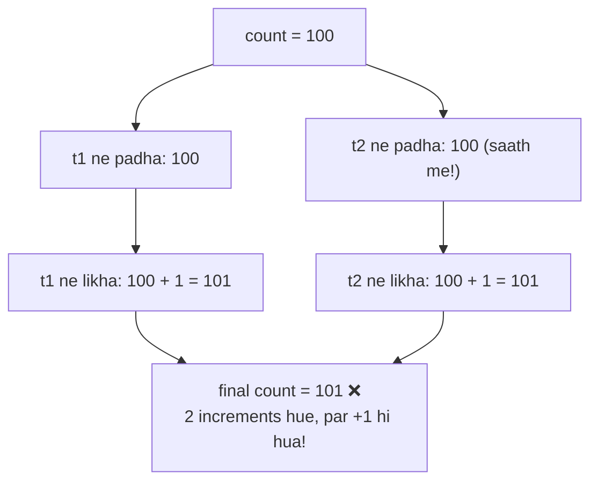
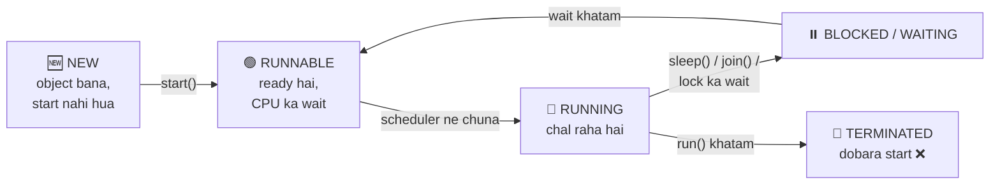

# 15 — Multithreading Basics: Ek Saath Kai Kaam 🎯 (Part 1 Finale 🎉)

> Music sun rahe ho + WhatsApp chal raha hai + download ho raha hai — SAB EK SAATH. Ye multithreading hai. Java me ye kaise hota hai, aaj basics samjhenge.

---

## 1. Thread kya hai? (Simple words)

- **Program** = likha hua code (recipe 📄)
- **Process** = chalta hua program (kitchen me cooking 🍳)
- **Thread** = process ke andar EK kaam karne wala worker (ek cook 👨‍🍳)

**Multithreading = ek process me KAI workers, alag-alag kaam EK SAATH.**

### 🏭 Analogy: Restaurant kitchen 🍽️
- 1 cook (single thread): pehle sabzi → fir roti → fir daal. Customer wait karta rahega!
- 3 cooks (multithreading): ek sabzi, ek roti, ek daal — SAATH ME. Khana jaldi ready! 🔥

### Ab tak tumhara har program single-threaded tha!
`main()` method jo chalata hai wo **main thread** hai — JVM khud banata hai. Ab hum APNE threads banayenge.

---

## 2. Thread banane ke 2 tarike

### Tarika 1: `extends Thread` (note 11 ka inheritance!)

```java
class MyThread extends Thread {
    @Override
    public void run() {                    // thread ka kaam yahan likho
        for (int i = 1; i <= 5; i++) {
            System.out.println("Worker: " + i);
        }
    }
}

public class Main {
    public static void main(String[] args) {
        MyThread t = new MyThread();
        t.start();                          // NAYA thread start — run() apne aap chalega

        for (int i = 1; i <= 5; i++) {
            System.out.println("Main: " + i);
        }
    }
}

// Possible output (HAR BAAR ALAG ho sakta hai!):
// Main: 1
// Worker: 1
// Worker: 2
// Main: 2
// ...dono INTERLEAVED — ek saath chal rahe hain!
```

### Tarika 2: `implements Runnable` (note 12 ka interface!) — RECOMMENDED ⭐

```java
class MyTask implements Runnable {
    @Override
    public void run() {
        System.out.println("Task chal raha hai: " + Thread.currentThread().getName());
    }
}

public class Main {
    public static void main(String[] args) {
        Thread t = new Thread(new MyTask());    // Runnable ko Thread me wrap karo
        t.start();
    }
}
```

### Runnable better kyu? (interview question 🎯)
- Java me ek hi class `extends` ho sakti hai (note 11!) — `extends Thread` kiya toh wo slot gaya. `implements Runnable` ke baad bhi kisi aur ko extend kar sakte ho + aur interfaces bhi laga sakte ho.
- Kaam (task) aur karne wala (thread) ALAG rehte hain — clean design.

---

## 3. `start()` vs `run()` — THE classic trap 🚨

```java
MyThread t = new MyThread();

t.start();    // ✅ NAYA thread banta hai, run() usme chalta hai — PARALLEL
t.run();      // ❌ koi naya thread NAHI! run() normal method ki tarah MAIN thread me chala
```

### 🏭 Analogy:
- `start()` = naye cook ko kitchen me bhejna 👨‍🍳 (wo apna kaam khud karega)
- `run()` = cook ki recipe KHUD padh ke KHUD banana 😅 (naya cook aaya hi nahi!)

⚠️ Ek thread pe `start()` sirf EK baar — dobara call kiya toh `IllegalThreadStateException` (note 13!).

---

## 4. `sleep()` — thread ko rokna

```java
for (int i = 3; i >= 1; i--) {
    System.out.println(i + "...");
    Thread.sleep(1000);               // 1000 ms = 1 second ruko
}
System.out.println("GO! 🚀");
```

⚠️ `sleep()` **checked exception** phenkta hai (note 13!) — `InterruptedException` handle karna COMPULSORY:

```java
try {
    Thread.sleep(1000);
} catch (InterruptedException e) {
    System.out.println("Neend toot gayi!");
}
// ya method pe: throws InterruptedException
```

---

## 5. `join()` — "pehle tu khatam kar, fir main"

```java
Thread t = new Thread(() -> {
    for (int i = 1; i <= 3; i++) System.out.println("Download: part " + i);
});

t.start();
t.join();                                    // main thread RUKEGA jab tak t khatam na ho
System.out.println("Download complete! Ab install karo");   // guaranteed LAST me
```

### 🏭 Analogy: Maggi ka intezaar 🍜
Paani ubalne wala kaam chal raha hai — tum Maggi tab tak NAHI daal sakte jab tak paani ready na ho. `join()` = "us kaam ke khatam hone ka wait karo, fir aage badho".

💡 Upar `() -> {...}` dikha? Ye **lambda** hai — Runnable ka shortcut (ek method wale interface ko direct likh do). Abhi bas itna samjho: `new Thread(() -> { kaam })` = quick thread!

---

## 6. Race Condition — jab threads ladte hain 💥

Do threads EK HI data ko SAATH me badlein → gadbad!

```java
class Counter {
    int count = 0;
    void increment() { count++; }        // dikhta 1 step, actually 3 steps: read → +1 → write
}

// 2 threads, dono 1000 baar increment:
Counter c = new Counter();
Thread t1 = new Thread(() -> { for (int i = 0; i < 1000; i++) c.increment(); });
Thread t2 = new Thread(() -> { for (int i = 0; i < 1000; i++) c.increment(); });
t1.start(); t2.start();
t1.join(); t2.join();

System.out.println(c.count);    // 2000 expect kiya... par aa sakta hai 1873! 😱
```

### 📊 Kyu? Dono ne SAME value padhi (lost update):



### 🏭 Analogy: Ek ATM, ek account, do log 🏧
Dono ne SAATH me balance dekha ₹1000, dono ne ₹500 nikale — dono ko screen pe ₹500 dikha. Bank ka nuksan! Solution: **ek baar me EK hi banda ATM room me** → door LOCK!

### Solution: `synchronized` — door lock 🔒

```java
synchronized void increment() { count++; }    // ek waqt me sirf EK thread andar
```

Ab result HAMESHA 2000. `synchronized` = method pe lock: ek thread andar hai toh baaki line me wait karenge.

---

## 7. Thread lifecycle (quick view)

### 📊 Poora lifecycle ek diagram me:



- **NEW**: object bana, start nahi hua
- **RUNNABLE**: ready hai, CPU ka wait
- **RUNNING**: chal raha hai
- **BLOCKED/WAITING**: sleep/join/lock ka wait
- **TERMINATED**: kaam khatam — dobara start ❌

💡 Kaunsa thread kab chalega — **JVM/OS scheduler** decide karta hai, TUM NAHI. Isliye output har run me alag ho sakta hai!

---

## 8. Common Beginner Mistakes ❌

1. `run()` call karna `start()` ki jagah → parallel chala hi nahi (sabse classic!).
2. Ek thread pe do baar `start()` → `IllegalThreadStateException`.
3. `sleep()` ka `InterruptedException` handle nahi karna → compile error.
4. Output ka FIXED order expect karna → scheduler ki marzi, har run alag!
5. Shared data bina `synchronized` ke → race condition (kabhi sahi, kabhi galat — debugging ka nightmare).
6. Har cheez synchronized kar dena → program slow; sirf shared-data wale methods pe lagao.

---

## 9. Practice: predict the output (answers hidden)

```java
// Q1 — kya output FIXED hai?
Thread t1 = new Thread(() -> System.out.println("A"));
Thread t2 = new Thread(() -> System.out.println("B"));
t1.start(); t2.start();

// Q2 — ab kya output FIXED hai?
Thread t3 = new Thread(() -> System.out.println("X"));
t3.start();
t3.join();
System.out.println("Y");

// Q3 — kya print hoga?
Thread t4 = new Thread(() -> System.out.println("Thread me hoon: " + Thread.currentThread().getName()));
t4.run();
```

<details>
<summary>👉 Click for answers</summary>

- **Q1:** NAHI fixed — "A B" ya "B A", scheduler ki marzi!
- **Q2:** FIXED — hamesha "X" fir "Y" (join() ne main ko rok liya jab tak t3 khatam na ho)
- **Q3:** Print hoga par thread name **"main"** aayega — `run()` direct call = koi naya thread nahi, main thread me hi chala! (start() hota toh "Thread-0" aata)

</details>

---

## 10. Quick Revision (30 seconds) ⚡

- Thread = process ke andar ek worker; multithreading = kai kaam ek saath.
- 2 tarike: `extends Thread` ya `implements Runnable` (Runnable better — extends slot bachta hai).
- **`start()` = naya thread; `run()` = normal method call** — kabhi mat bhoolna!
- `sleep(ms)` = pause (InterruptedException handle karo); `join()` = uske khatam hone ka wait.
- Race condition = shared data + kai threads; solution = `synchronized` (door lock 🔒).
- Output order scheduler decide karta hai — har run alag ho sakta hai.

---

## 🎉 PART 1 COMPLETE! Saari 15 notes done!

Java Basics se Multithreading tak ka safar poora hua. Ab aage: **Part 2 — Coding Questions** (Easy / Medium / Hard / Important / Logic-Building) — jahan ye saare concepts practice se pakke honge! 💪

---

⬅️ **Previous:** [14 — Collections](14-collections.md) | 🏠 [Back to Roadmap](../README.md)
